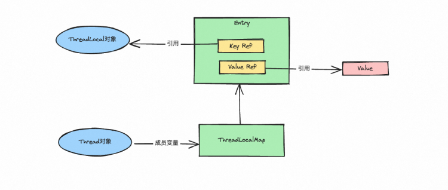

# ✅Java中的四种引用有什么区别？
<!--page header-->

JDK1.2 以后，Java 对引用的概念进行了扩充，将引用分为**强引用、软引用、弱引用、虚引用**四种（引用强度逐渐减弱）

**强引用**：强引用是Java的默认引用形式，使用时不需要显示定义。如果一个对象具有强引用，那垃圾回收器绝不会回收它（可达时）。当内存空间不足，Java虚拟机宁愿抛出OutOfMemoryError错误，使程序异常终止，也不会靠随意回收具有强引用的对象来解决内存不足的问题。

```
String[] arr = new String[]{"a", "b", "c"};
```

**弱引用**： 如果一个对象只具有弱引用，无论内存充足与否，Java GC后对象如果只有弱引用将会被自动回收。

```
WeakReference<String[]> weakBean = new WeakReference<String[]>(new String[]{"a", "b", "c"});
```

**软引用**： 软引用不会保证对象一定不会被回收，只能最大可能保证。软引用和弱引用的特性基本一致， 主要的区别在于软引用在内存不足时才会被回收。如果一个对象只具有软引用，Java GC在内存充足的时候不会回收它，内存不足时才会被回收。

```
SoftReference<String[]> softBean = new SoftReference<String[]>(new String[]{"a", "b", "c"});
```

**虚引用**：java.lang.ref.PhantomReference 类中只有一个方法 get()，而且几乎没有实现，只是返回 null。如果一个对象仅有虚引用，那么它就像没有任何引用一样，在任何时候都可能被 gc 回收。虚引用主要用来跟踪对象被垃圾回收的活动。

| **特性** | **强引用** | **软引用** | **弱引用** | **虚引用** |
| --- | --- | --- | --- | --- |
| 生命周期 | 最长 | 次于强引用 | 次于软引用 | 次于弱引用 |
| OOM前被清理 | 否 | 是 | 是 | 是 |
| Gc前被清理 | 否 | 否 | 是 | 是 |


<a name="NMyil"></a>
### 弱引用的例子
ThreadLocal就是用了弱引用。下面是一个简单ThreadLocal和Thread的引用图：

因为在Entry中，对于ThreadLocal使用的弱引用，所以当ThreadLocal没有其他引用的时候，Entry中的threadLocal变量就会在下一次GC的时候被回收掉

但是虽然threadLocal被回收了，Entry中的value还没有回收，这样就可能产生内存泄漏。

[什么是ThreadLocal，如何实现的？](https://www.yuque.com/hollis666/axzrte/ihoye3?view=doc_embed)


<!--page footer-->
- 原文: <https://www.yuque.com/hollis666/axzrte/mx9eo0s2s5iaah2s>