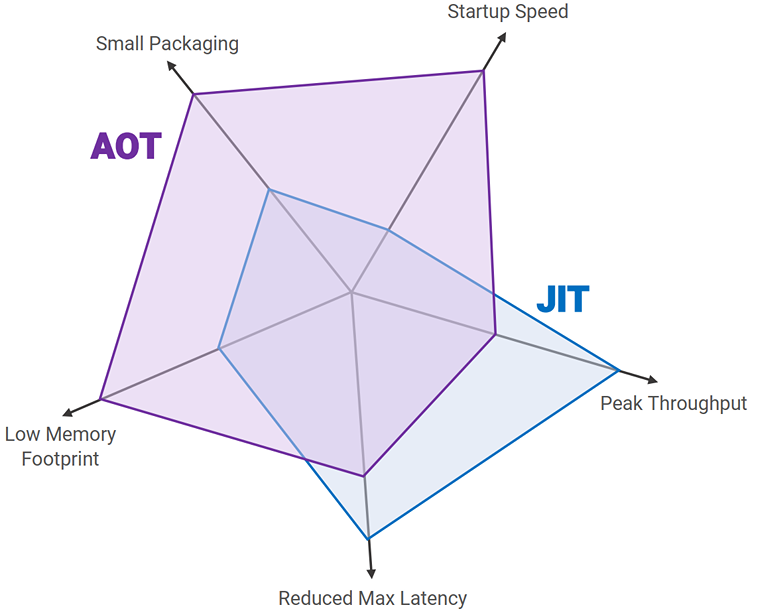

# ✅什么是AOT编译？和JIT有啥区别？
<!--page header-->

# 典型回答

我们都知道，Java中有两种编译方法：
1、javac把java代码编译成字节码，然后由Java虚拟机解释执行。
2、JIT把java代码直接编译成机器码，然后由Java虚拟机直接运行。

[✅简单介绍一下JIT优化技术？](https://www.yuque.com/hollis666/axzrte/nkr4ge?view=doc_embed)

但是，JIT编译有一些比较明显的缺点也是不能忽视的：

1. **增加启动时间**：由于JIT编译器在程序运行时编译代码，它可能导致应用程序的启动时间较长。
2. **可能会影响应用性能**：JIT编译是需要进行热点代码检测、代码编译等动作的，这些都是要占用运行期的资源，所以，JIT编译过程中也可能会影响应用性能。

而在如今的云原生盛行的今天，应用的快速启动以及减少预热时长是非常重要的，其实是Serverless场景中，所以，一个新兴的编译器GraalVM就诞生了。他提出了一种新的编译方式——Ahead of Time，及AOT编译。

**AOT编译**，翻译一下就是提前编译，它不像JIT一样在运行期才生成机器码，而是在编译期间就将字节码转换为机器码，这就直接省去了运行时对JVM的依赖。

这里多说一句，很多人会误以为编译期的编译不是javac吗？其实javac只是把源代码(.java)编译成中间代码(.class），这种中间代码我们叫做字节码，而字节码并不是机器代码，无法直接执行，需要解释器进行解释执行。详见：
[✅Java是编译型还是解释型?](https://www.yuque.com/hollis666/axzrte/ylde5u?view=doc_embed)

因为AOT编译是在编译期就生成机器代码了，所以，应用启动时就不需要编译，那么他就可以大大的减少应用的启动时间，提升系统的整体性能。所以他非常适用于对启动时间敏感的场景，例如云原生应用。

<!--page footer-->
- 原文: <https://www.yuque.com/hollis666/axzrte/cy5i6guhszisviks>