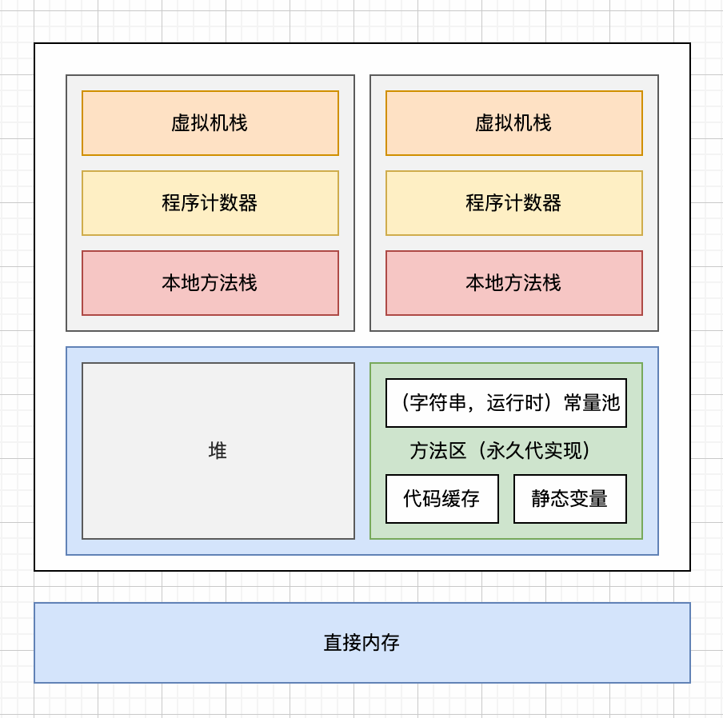
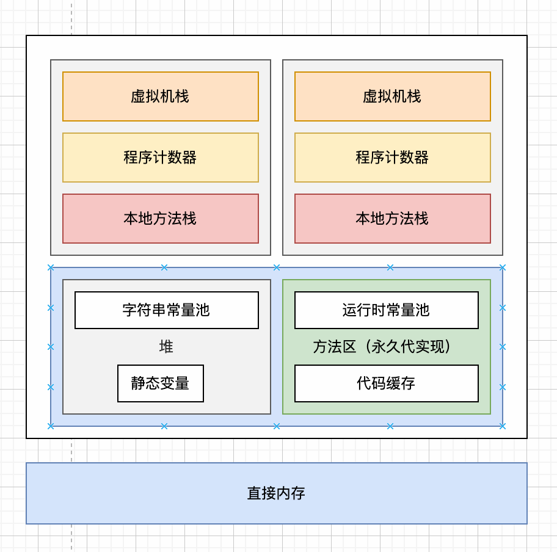
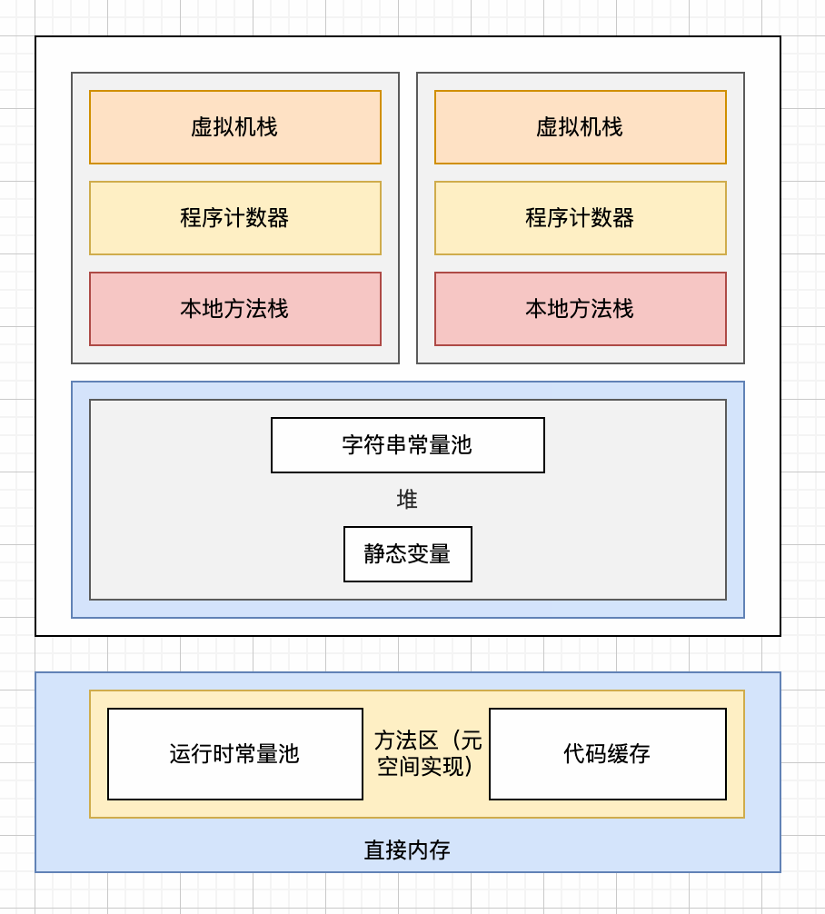

# ✅什么是方法区？是如何实现的？
<!--page header-->

# 典型回答

方法区是Java虚拟机规范定义的一块用于存储类信息、常量、静态变量、编译器编译后的代码等数据的内存区域。

方法区是线程共享的，每个虚拟机实例只有一个方法区。**实现方法区的方式在不同的JDK厂商以及不同版本中可能有所不同的。**所谓规范是规范，实现是实现，两码事儿。

我们拿主流的HotSpot虚拟机来说明一下他的实现机制。

在JDK 1.7及之前的版本中，方法区通常被实现为**永久代（Permanent Generation）**，用于存储类信息、常量池、静态变量、即时编译器编译后的代码等数据。

不过在1.6中，方法区中包含了字符串常量池，而在1.7中，把字符串常量池、和静态变量都移到了堆内存中。这么做的主要原因是因为永久代的 GC 回收效率太低，只有在FullGC的时候才会被执行回收。但是Java中往往会有很多字符串也是朝生夕死的，将字符串常量池放到堆中，能够更高效及时地回收字符串内存

下图是1.6VS1.7的对比：

由于永久代有固定的大小，且不容易调整，因此在一些场景下容易导致内存溢出。例如，如果应用程序中使用大量的动态生成类或者频繁地加载卸载类，就可能导致永久代溢出。

所以，从JDK 1.8开始，HotSpot虚拟机对方法区的实现进行了重大改变。永久代被移除，取而代之的是**元空间（Metaspace）**。元空间是使用本地内存（Native Memory）来存储类的元数据信息的，它不再位于堆内存中。

元空间的特点是可以根据应用程序的需要动态调整其大小，因此更加灵活。它能够有效地避免了永久代的内存溢出问题，并且可以减少垃圾回收的压力。元空间的内存使用量受限于操作系统对本地内存的限制。

<!--page footer-->
- 原文: <https://www.yuque.com/hollis666/axzrte/bk9qtiiqisie4f5a>