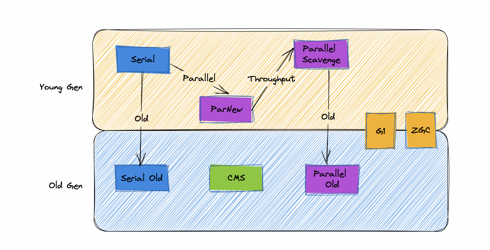
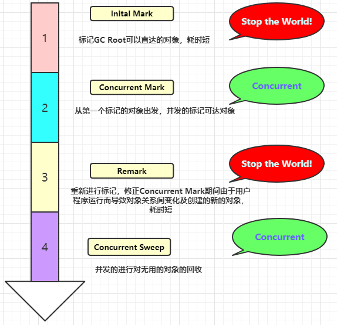

# ✅新生代和老年代的垃圾回收器有何区别？
<!--page header-->

# 典型回答

常见的垃圾回收器如下：

1.  串行垃圾回收器（Serial Garbage Collector） 如：Serial GC， Serial Old
2.  并行垃圾回收器（Parallel Garbage Collector） 如：Parallel Scavenge，Parallel Old，ParNew
3.  并发标记扫描垃圾回收器（CMS Garbage Collector） 
4.  G1垃圾回收器（G1 Garbage Collector，JDK 7中推出，JDK 9中设置为默认） 
5. ZGC垃圾回收器（The Z Garbage Collector，JDK 11 推出）

**新生代收集器有Serial、ParNew、Parallel Scavenge；**
**老年代收集器有Serial Old、Parallel Old、CMS。**
**整堆收集器有G1、ZGC**

# 扩展知识

## 串行垃圾收集器

### Serial GC
**Serial是单线程的串行垃圾回收器，主要采用**`**标记-复制算法**`**进行垃圾回收。**

单线程地好处就是减少上下文切换，减少系统资源的开销。但这种方式的缺点也很明显，在GC的过程中，必须暂停其他所有的工作线程，直至Serial收集器收集结束为止（Stop The World）。若GC不是频繁发生，这或许是一个不错的选择，否则将会影响程序的执行性能。 

### Serial Old

**Serial Old是Serial的老年代版本，也是个单线程收集器，适用于老年代，使用的是**`**标记-整理算法**`**。**

优缺点基本和Serial差不多，二者主要是回收算法不一样。

## 并行垃圾收集器

### ParNew

**ParNew其实就是Serial的多线程版本，在参数、回收算法上，和Serial是完全一样的，所以他也是采用**`**标记-复制算法**`**进行垃圾回收的。**

ParNew在垃圾回收的时候，同样会STW，但是因为它是多线程并行进行垃圾回收的，所以通常情况下时间会比Serial短一些。

### Parallel Scavenge

**Parallel Scavenge 也是一个新生代的垃圾回收器，和ParNew一样，他也是多线程并发执行的，同样采用的也是**`**标记-复制算法**`。与ParNew最大的不同是，Parallel Scavenge 关注的是垃圾回收的吞吐量（吞吐量=代码运行时间/(代码运行时间+垃圾收集时间)，以吞吐量优先。

因为Parallel Scavenge收集器的高吞吐量可以最高效率的利用CPU时间，尽快的完成程序的运算任务等，所以他主要适合在后台运算，比如一些定时任务的执行。

### Parallel Old
**Parallel 是 Parallel Scavenge的老年代版本，同样是一个关注吞吐量的并行垃圾收集器，他采用的是**`**标记-整理算法**`**算法进行垃圾回收的。**

## CMS

CMS，Concurrent Mark Sweep，同样是老年代的收集器。他也是一个并发执行的垃圾收集器，他和Parallel最大的区别是他更加关注垃圾回收的停顿时间，通过他的名字Concurrent Mark Sweep就可以知道，他采用的是耗时更短的`**标记-清除算法**`。

CMS收集器的工作流程主要有下面4个步骤：

1. 初始标记：独占CPU，仅标记GCroots能直接关联的对象（STW）
2. 并发标记：可以和用户线程并发执行，标记所有可达对象
3. 重新标记：独占CPU，对并发标记阶段用户线程运行产生的垃圾对象中产生变动的一部分对象进行标记修正(STW)
4. 并发清理：可以和用户线程并发执行，清理垃圾

**从上面的四个步骤中可以看出，CMS的过程中，只有初始标记和重新标记这两个步骤是STW的，所以，相比其他的收集器整个回收过程都STW来说，他导致的应用停顿时间更短。**

优点:

1. 并发
2. 低停顿

缺点：

1. 对CPU非常敏感：在并发阶段虽然不会导致用户线程停顿，但是会因为占用了一部分线程使应用程序变慢
2. 无法处理浮动垃圾：在最后一步并发清理过程中，用户线程执行也会产生垃圾，但是这部分垃圾是在标记之后，所以只有等到下一次gc的时候清理掉，这部分垃圾叫浮动垃圾
3. CMS使用“标记-清理”法会产生大量的空间碎片，当碎片过多，将会给大对象空间的分配带来很大的麻烦，往往会出现老年代还有很大的空间但无法找到足够大的连续空间来分配当前对象，不得不提前触发一次FullGC，为了解决这个问题CMS提供了一个开关参数，用于在CMS顶不住，要进行FullGC时开启内存碎片的合并整理过程，但是内存整理的过程是无法并发的，空间碎片没有了但是停顿时间变长了

## 并发回收与并行回收

[✅说一说JVM的并发回收和并行回收](https://www.yuque.com/hollis666/axzrte/srfo2k1o2nq4dp7f?view=doc_embed)

## G1
[简单介绍一下G1垃圾收集器？](https://www.yuque.com/hollis666/axzrte/hgquufzt6m9psmtp?view=doc_embed)

## ZGC

[JDK 11中新出的ZGC有什么特点？](https://www.yuque.com/hollis666/axzrte/qpu0uu6em1ompzeh?view=doc_embed)

<!--page footer-->
- 原文: <https://www.yuque.com/hollis666/axzrte/nqra2l>