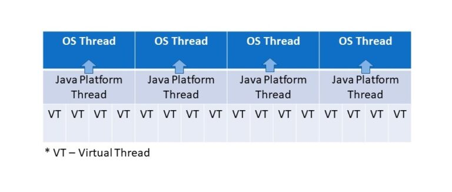

# ✅JDK21 中的虚拟线程是怎么回事？
<!--page header-->

<a name="ROTEq"></a>
# 典型回答

虚拟线程这个名字很多人可能比较懵，但是如果对像Go、Ruby、python等语言有一些了解的话，就会很快的反应过来，其实这就是协程。

在以前的JDK中，Java的线程模型其实比较简单，在大多数操作系统中，主要采用的是基于轻量级进程实现的一对一的线程模型，简单来说就是每一个Java线程对应一个操作系统中的轻量级进程，这种线程模型中的线程创建、析构及同步等动作，都需要进行系统调用。而系统调用则需要在用户态（User Mode）和内核态（Kernel Mode）中来回切换，所以性能开销还是很大的。

而新引入的虚拟线程，是JDK 实现的轻量级线程，他可以避免上下文切换带来的的额外耗费。他的实现原理其实是JDK不再是每一个线程都一对一的对应一个操作系统的线程了，而是会将多个虚拟线程映射到少量操作系统线程中，通过有效的调度来避免那些上下文切换。

在JDK 21，有多种方法可以创建协程，如Thread.startVirtualThread()、Executors.newVirtualThreadPerTaskExecutor()等。
<a name="m4rwK"></a>
# 扩展知识

<a name="4683f754"></a>
## 线程的实现方式

我们都知道，在操作系统中，线程是比进程更轻量级的调度执行单位，线程的引入可以把一个进程的资源分配和执行调度分开，各个线程既可以共享进程资源，又可以独立调度。

其实，**线程的实现方式主要有三种：分别是使用内核线程实现、使用用户线程实现以及使用用户线程加轻量级进程混合实现。**

<a name="8bcd0c28"></a>
### 使用内核线程实现

**内核线程（Kernel-Level Thread,KLT）就是直接由操作系统内核（Kernel）支持的线程，这种线程由内核来完成线程切换，内核通过操纵调度器（Scheduler）对线程进行调度，并负责将线程的任务映射到各个处理器上，并向应用程序提供API接口来管理线程。**

应用程序一般不会直接去使用内核线程，而是去使用内核线程的一种高级接口——轻量级进程（Light Weight Process,LWP），轻量级进程就是我们通常意义上所讲的线程，由于每个轻量级进程都由一个内核线程支持，因此只有先支持内核线程，才能有轻量级进程。

有了内核线程的支持，每个轻量级进程都成为一个独立的调度单元，即使有一个轻量级进程在系统调用中阻塞了，也不会影响整个进程继续工作。

但是轻量级进程具有它的局限性：首先，由于是基于内核线程实现的，所以各种线程操作，如创建、析构及同步，都需要进行系统调用。而系统调用的代价相对较高，需要在用户态（User Mode）和内核态（Kernel Mode）中来回切换。其次，每个轻量级进程都需要有一个内核线程的支持，因此轻量级进程要消耗一定的内核资源（如内核线程的栈空间），因此一个系统支持轻量级进程的数量是有限的。

<a name="8e4981fa"></a>
### 使用用户线程实现

在用户空间建立线程库，通过运行时系统(Run-time System)来完成线程的管理，因为这种线程的实现是在用户空间的，所以操作系统的内核并不知道线程的存在，所以内核管理的还是进程，所以这种线程的切换不需要内核操作。

这种实现方式下，进程和线程之间的关系是一对多的。

这种线程实现方式的优点是线程切换快，并且可以运行在任何操作系统之上，只需要实现线程库就行了。**但是缺点也比较明显，就是所有线程的操作都需要用户程序自己处理，并且因为大多数系统调用都是阻塞的，所以一旦一个进程阻塞了，那么进程中的所有线程也会被阻塞。还有就是多处理器系统中如何将线程映射到其他处理器上也是一个比较大的问题。**

<a name="af2d12f8"></a>
### 使用用户线程加轻量级进程混合实现

还有一种混合实现的方式，就是线程的创建在用户空间完成，通过线程库进行，但是线程的调度是由内核来完成的。多个用户线程通过多路复用来复用多个内核线程。这个就不展开讲了。

<a name="39024a28"></a>
## Java的线程实现

以上讲的是操作系统的线程的实现的三种方式，不同的操作系统在实现线程的时候会采用不同的机制，比如windows采用的是内核线程实现的，而Solaris则是通过混合模式实现的。

而Java作为一门跨平台的编程语言，实际上他的线程的实现其实是依赖具体的操作系统的。而比较常用的windows和linux来说，都是采用的内核线程的方式实现的。

也就是说，当我们在JAVA代码中创建一个Thread的时候，其实是需要映射到操作系统的线程的具体实现的，因为常见的通过内核线程实现的方式在创建、调度时都需要进行内核参与，所以成本比较高，尽管JAVA中提供了线程池的方式来避免重复创建线程，但是依旧有很大的优化空间。**而且这种实现方式意味着受机器资源的影响，平台线程数也是有限制的。**

<a name="7feaf14f"></a>
## 虚拟线程

**JDK 19引入的虚拟线程，是JDK 实现的轻量级线程，他可以避免上下文切换带来的的额外耗费。**他的实现原理其实是JDK不再是每一个线程都一对一的对应一个操作系统的线程了，而是会将多个虚拟线程映射到少量操作系统线程中，通过有效的调度来避免那些上下文切换。



而且，我们可以在应用程序中创建非常多的虚拟线程，而不依赖于平台线程的数量。这些虚拟线程是由JVM管理的，因此它们不会增加额外的上下文切换开销，因为它们作为普通Java对象存储在RAM中。

<a name="060f6378"></a>
## 虚拟线程和平台线程的区别

首先，虚拟线程总是守护线程。setDaemon (false)方法不能将虚拟线程更改为非守护线程。**所以，需要注意的是，当所有启动的非守护线程都终止时，JVM将终止。这意味着JVM不会等待虚拟线程完成后才退出。**

其次，即使使用setPriority()方法，**虚拟线程始终具有normal的优先级**，且不能更改优先级。在虚拟线程上调用此方法没有效果。

还有就是，**虚拟线程是不支持stop()、suspend()或resume()等方法**。这些方法在虚拟线程上调用时会抛出UnsupportedOperationException异常。

<a name="481feccf"></a>
## 如何使用

接下来介绍一下，在JDK 19中如何使用虚拟线程。

首先，通过Thread.startVirtualThread()可以运行一个虚拟线程：

```
Thread.startVirtualThread(() -> {
    System.out.println("虚拟线程执行中...");
});
```

其次，通过Thread.Builder也可以创建虚拟线程，Thread类提供了ofPlatform()来创建一个平台线程、ofVirtual()来创建虚拟线程。

```
Thread.Builder platformBuilder = Thread.ofPlatform().name("平台线程");
Thread.Builder virtualBuilder = Thread.ofVirtual().name("虚拟线程");

Thread t1 = platformBuilder .start(() -> {...}); 
Thread t2 = virtualBuilder.start(() -> {...});
```

另外，线程池也支持了虚拟线程，可以通过Executors.newVirtualThreadPerTaskExecutor()来创建虚拟线程：

```
try (var executor = Executors.newVirtualThreadPerTaskExecutor()) {
    IntStream.range(0, 10000).forEach(i -> {
        executor.submit(() -> {
            Thread.sleep(Duration.ofSeconds(1));
            return i;
        });
    });
}
```

但是，**其实并不建议虚拟线程和线程池一起使用**，因为Java线程池的设计是为了避免创建新的操作系统线程的开销，但是创建虚拟线程的开销并不大，所以其实没必要放到线程池中。

<a name="1498c7ec"></a>
## 性能差异

说了半天，虚拟线程到底能不能提升性能，能提升多少呢？我们来做个测试。

我们写一个简单的任务，在控制台中打印消息之前等待1秒：

```
final AtomicInteger atomicInteger = new AtomicInteger();

Runnable runnable = () -> {
  try {
    Thread.sleep(Duration.ofSeconds(1));
  } catch(Exception e) {
      System.out.println(e);
  }
  System.out.println("Work Done - " + atomicInteger.incrementAndGet());
};
```

现在，我们将从这个Runnable创建10,000个线程，并使用虚拟线程和平台线程执行它们，以比较两者的性能。

先来我们比较熟悉的平台线程的实现：

```
Instant start = Instant.now();

try (var executor = Executors.newFixedThreadPool(100)) {
  for(int i = 0; i < 10_000; i++) {
    executor.submit(runnable);
  }
}

Instant finish = Instant.now();
long timeElapsed = Duration.between(start, finish).toMillis();  
System.out.println("总耗时 : " + timeElapsed);
```

输出结果为：

```
总耗时 : 102323
```

总耗时大概100秒左右。接下来再用虚拟线程跑一下看看

> 在JDK 21中已经是正式功能了，但是在JDK 19中，虚拟线程是一个预览API，默认是禁用。所以需要使用$ java——source 19——enable-preview xx.java 的方式来运行代码。


```
Instant start = Instant.now();

try (var executor = Executors.newVirtualThreadPerTaskExecutor()) {
  for(int i = 0; i < 10_000; i++) {
    executor.submit(runnable);
  }
}

Instant finish = Instant.now();
long timeElapsed = Duration.between(start, finish).toMillis();  
System.out.println("总耗时 : " + timeElapsed);
```

使用 Executors.newVirtualThreadPerTaskExecutor()来创建虚拟线程，执行结果如下：

```
总耗时 : 1674
```

总耗时大概1.6秒左右。

100秒和1.6秒的差距，足以看出虚拟线程的性能提升还是立竿见影的。


<!--page footer-->
- 原文: <https://www.yuque.com/hollis666/axzrte/ac1a0q>