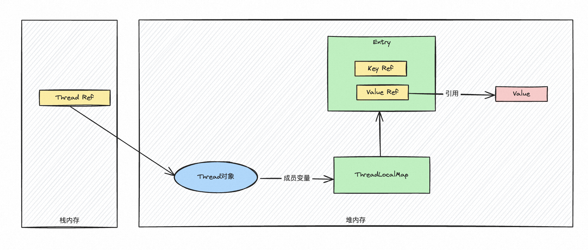
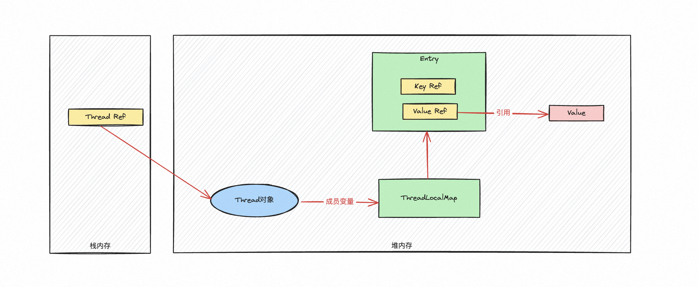
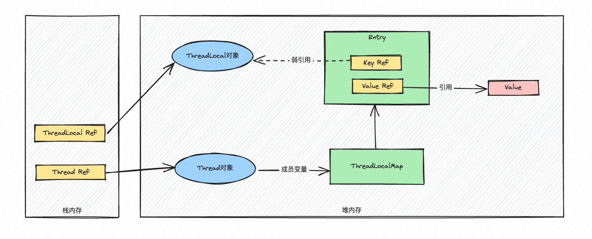

# ✅ThreadLocal为什么会导致内存泄漏？如何解决的？
<!--page header-->

<a name="Jw2ka"></a>
# 典型回答

[✅什么是ThreadLocal，如何实现的？](https://www.yuque.com/hollis666/axzrte/ihoye3?view=doc_embed)

ThreadLocal的内存泄露问题是一个比较典型的问题，可以说这个问题，**ThreadLocal帮我们解决了一半，还有一半需要开发者自己解决。**

[✅内存泄漏和内存溢出的区别是什么？](https://www.yuque.com/hollis666/axzrte/ge1k2i2aumhsgvbc?view=doc_embed)

<a name="RJXZP"></a>
### 内存泄漏来自哪？

会导致ThreadLocal内存泄漏的部分其实就是他在堆上存储的ThreadLocalMap中的K-V部分：


ThreadLocalMap的key就是ThreadLocal对象，他有两个引用源，一**个是栈上的ThreadLocal引用，一个是ThreadLocalMap中的Key对他的引用。**


而对于value来说，他的引用就一条，就是从Thread对象过来的。



所以，就会出现以下两种情况：

1、栈上的ThreadLocal Ref引用不在使用了，即方法结束后这个对象引用就不再用了，那么，ThreadLocal对象因为还有一条引用链在，所以就会导致他无法被回收，久而久之可能就会对导致OOM。


2、Thread对象如果一直在被使用，比如在线程池中被重复使用，那么从这条引用链就一直在，那么就会导致ThreadLocalMap无法被回收。



<a name="va4DK"></a>
### 弱引用解决内存泄漏

我们先来说说JDK自己帮我们实现的一部分功能，主要是解决上面说的第一种情况：

> 栈上的ThreadLocal Ref引用不在使用了，即方法结束后这个对象引用就不再用了，那么，ThreadLocal对象因为还有一条引用链在，所以就会导致他无法被回收，久而久之可能就会对导致OOM。


为了解决这个问题，ThreadLocalMap使用了**弱引用**。


从ThreadLocalMap中的一段代码说起的，这段代码就是Entry的构造方法：
  
```
static class Entry extends WeakReference<ThreadLocal<?>> {
    /** The value associated with this ThreadLocal. */
    Object value;

    Entry(ThreadLocal<?> k, Object v) {
        super(k);
        value = v;
    }
}
```
 }
我们从ThreadLocal的内部静态类Entry的代码设计可知，ThreadLocal的引用k通过构造方法传递给了Entry类的父类WeakReference的构造方法，从这个层面来说，可以理解ThreadLocalMap中的键是ThreadLocal的弱引用。

> 强引用：Java中默认的引用类型，一个对象如果具有强引用那么只要这种引用还存在就不会被回收。比如String str = new String("Hello ThreadLocal");，其中str就是一个强引用，当然，一旦强引用出了其作用域，那么强引用随着方法弹出线程栈，那么它所指向的对象将在合适的时机被JVM垃圾收集器回收。
> 
> 软引用：如果一个对象具有软引用，在JVM发生内存溢出之前（即内存充足够使用），是不会GC这个对象的；只有到JVM内存不足的时候才会调用垃圾回收期回收掉这个对象。软引用和一个引用队列联合使用，如果软引用所引用的对象被回收之后，该引用就会加入到与之关联的引用队列中。
> 
> 弱引用：这里讨论ThreadLocalMap中的Entry类的重点，如果一个对象只具有弱引用，那么这个对象就会被垃圾回收器回收掉（被弱引用所引用的对象只能生存到下一次GC之前，当发生GC时候，无论当前内存是否足够，弱引用所引用的对象都会被回收掉）。弱引用也是和一个引用队列联合使用，如果弱引用的对象被垃圾回收期回收掉，JVM会将这个引用加入到与之关联的引用队列中。弱引用的对象可以通过弱引用的get方法得到，当引用的对象被回收掉之后，再调用get方法就会返回null。
> 
> 虚引用：虚引用是所有引用中最弱的一种引用，其存在就是为了将关联虚引用的对象在被GC掉之后收到一个通知。


如果用了弱引用，那么ThreadLocal对象就可以在下次GC的时候被回收掉了。

这样做可以很大程度上的避免因为ThreadLocal的使用而导致的OOM问题，但是这个问题却无法彻底避免。

<a name="Xlm0t"></a>
### 手动清理ThreadLocal

上面的弱引用，解决了ThreadLocal中key的引用一直在无法被回收的问题，但是value的问题还是没解决。

> Thread对象如果一直在被使用，比如在线程池中被重复使用，那么从这条引用链就一直在，那么就会导致ThreadLocalMap无法被回收。




因为我们可以看到，虽然key是弱引用，但是value的那条引用，还是个强引用呢！而且他的生命周期是和Thread一样的，也就是说，只要这个Thread还在， 这个对象就无法被回收。

那么，什么情况下，Thread会一直在呢？那就是线程池。

在线程池中，重复利用线程的时候，就会导致这个引用一直在，而value就一直无法被回收。

那么如何解决呢？

ThreadLocalMap底层使用数组来保存元素，使用“线性探测法”来解决hash冲突的，在每次调用ThreadLocal的get、set、remove等方法的时候，内部会实际调用ThreadLocalMap的get、set、remove等操作。

而ThreadLocalMap的每次get、set、remove，都会清理key为null,但是value还存在的Entry。

**所以，当我们在一个ThreadLocal用完之后，手动调用一下remove，就可以在下一次GC的时候，把Entry清理掉。**


<!--page footer-->
- 原文: <https://www.yuque.com/hollis666/axzrte/bueq7weva8ha9f1p>