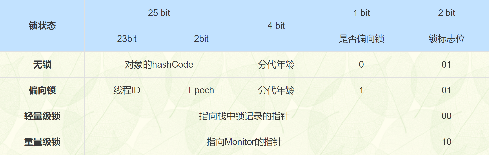

# ✅synchronized的锁升级过程是怎样的？
<!--page header-->

# 典型回答

在JDK 1.6及之前的版本中，synchronized锁是通过对象内部的一个叫做监视器锁（也称对象锁）来实现的。当一个线程请求对象锁时，如果该对象没有被锁住，线程就会获取锁并继续执行。如果该对象已经被锁住，线程就会进入阻塞状态，直到锁被释放。这种锁的实现方式称为**“重量级锁”**，因为获取锁和释放锁都需要在操作系统层面上进行线程的阻塞和唤醒，而这些操作会带来很大的开销。

在JDK 1.6之后，synchronized锁的实现发生了一些变化，引入了“偏向锁”、“轻量级锁”和“重量级锁”三种不同的状态，用来适应不同场景下的锁竞争情况。

在JDK 15 中，废弃了偏向锁（[https://openjdk.org/jeps/374](https://openjdk.org/jeps/374) ）

所以，在Java中，锁的状态分为四种，分别是无锁状态、偏向锁状态、轻量级锁状态和重量级锁状态。在Java中，mark word的低两位用于表示锁的状态，分别为“01”（无锁状态）、“01”（偏向锁状态）、“00”（轻量级锁状态）和“10”（重量级锁状态）。但是由于无锁状态和偏向锁都是"01"，所以在低三位引入偏向锁标记位，用"0"表示无锁，"1"表示偏向。

以下偏向过程基于OpenJDK 8 源码总结的，源码地址：[https://github.com/openjdk/jdk8u/blob/master/hotspot/src/share/vm/runtime/synchronizer.cpp](https://github.com/openjdk/jdk8u/blob/master/hotspot/src/share/vm/runtime/synchronizer.cpp)

具体的锁升级过程如下，这里为了方便大家理解，暂时不包含自旋相关的内容，锁升级过程中的自旋参考：

[synchronized升级过程中有几次自旋？](https://www.yuque.com/hollis666/axzrte/dc6vfx4nfvptib2y?view=doc_embed)

### 无锁

当一个线程第一次访问一个对象的同步块时，JVM会在对象头中设置该线程的Thread ID，并将对象头的状态位设置为“偏向锁”。这个过程称为“偏向”，表示对象当前偏向于第一个访问它的线程。

### 偏向锁（Biased Locking）

当一个synchronized块被线程首次进入时，锁对象会进入偏向模式。

在偏向锁模式下，锁会偏向于第一个获取它的线程，JVM 会在对象头中记录该线程的 ID 作为偏向锁的持有者，并将对象头中的 Mark Word 中的一部分作为偏向锁标识。

在这种情况下，如果其他线程访问该对象，会先检查该对象的偏向锁标识，如果和自己的线程 ID 相同，则直接获取锁。如果不同，则该对象的锁状态就会升级到轻量级锁状态。

**触发条件**：首次进入synchronized块时自动开启，假设JVM启动参数没有禁用偏向锁。

### 轻量级锁（Lightweight Locking）

当有另一个线程尝试获取已被偏向的锁时，偏向锁会被撤销，锁会升级为轻量级锁。

在轻量级锁状态中，JVM 为对象头中的 Mark Word 预留了一部分空间，用于存储指向线程栈中锁记录的指针。

当一个线程访问该对象时，JVM 会将对象头中的 Mark Word 复制一份到线程栈中，并在对象头中存储线程栈中的指针。此时，如果另一个线程想要访问该对象，会发现该对象已经处于轻量级锁状态，并尝试使用 CAS 操作将对象头中的指针替换成自己的指针。

如果替换成功，则该线程获取锁成功；如果失败，则表示已经有其他线程获取了锁，则该锁状态就会升级到重量级锁状态。

**触发条件**：当有另一个线程尝试获取已被偏向的锁时，偏向锁会升级为轻量级锁。

### 重量级锁（Heavyweight Locking）

当轻量级锁的CAS操作失败，即出现了实际的竞争，锁会进一步升级为重量级锁。

当锁状态升级到重量级锁状态时，JVM 会将该对象的锁变成一个重量级锁，并在对象头中记录指向等待队列的指针。

此时，如果一个线程想要获取该对象的锁，则需要先进入等待队列，等待该锁被释放。当锁被释放时，JVM 会从等待队列中选择一个线程唤醒，并将该线程的状态设置为“就绪”状态，然后等待该线程重新获取该对象的锁。

**触发条件**：当轻量级锁的CAS操作失败，轻量级锁升级为重量级锁。

<!--page footer-->
- 原文: <https://www.yuque.com/hollis666/axzrte/cv5kt1>