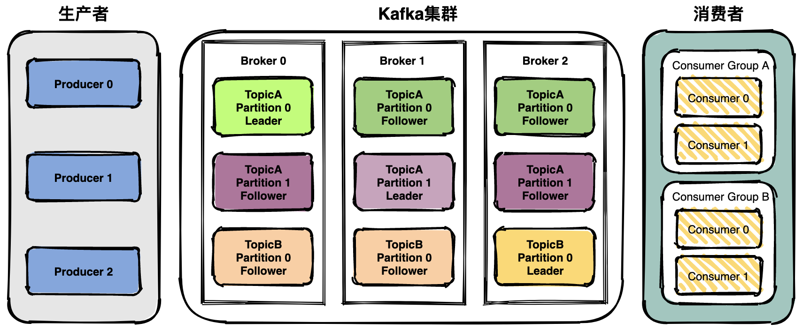

# ✅Kafka的架构是怎么样的？
<!--page header-->

# 典型回答

Kafka 的整体架构比较简单，是显式分布式架构，主要由 Producer（生产者）、broker（Kafka集群）和 consumer（消费者） 组成。

**生产者（Producer）**：生产者负责将消息发布到Kafka集群中的一个或多个主题(Topic)，每个Topic包含一个或多个分区（Partition）。

> 主题：Topic。主题是承载消息的逻辑容器，在实际使用中多用来区分具体的业务。
> 分区：Partition。一个有序不变的消息序列。每个主题下可以有多个分区。

**消费者（Consumer**）：消费者负责从Kafka集群中的一个或多个主题消费消息，并将消费的偏移量（Offset）提交回Kafka以保证消息的顺序性和一致性。

> 偏移量：Offset。表示分区中每条消息的位置信息，是一个单调递增且不变的值。

**Kafka集群**：Kafka集群是由多个Kafka节点（Broker）组成的分布式系统。每个节点都可以存储一个或多个主题的分区副本，以提供高可用性和容错能力。

> **Leader Broker**：Leader Broker 是分区的主副本，它是负责处理消息读写请求的节点。生产者将消息发送到 Leader Broker，消费者从 Leader Broker 中拉取消息。
> **Follower Broke**r：Follower Broker 是 Leader Broker 的备份节点，它负责与 Leader Broker 进行数据同步，以保持自己的数据与 Leader Broker 保持一致。
> 

> **在集群中，每个分区都有一个 Leader Broker 和多个 Follower Broker，只有 Leader Broker 才能处理生产者和消费者的请求，而 Follower Broker 只是 Leader Broker 的备份，用于提供数据的冗余备份和容错能力。如果 Leader Broker 发生故障，Kafka 集群会自动将 Follower Broker 提升为新的 Leader Broker，从而实现高可用性和容错能力。**

**ZooKeeper**：ZooKeeper是Kafka集群中使用的分布式协调服务，用于维护Kafka集群的状态和元数据信息，例如主题和分区的分配信息、消费者组和消费者偏移量等。

<!--page footer-->
- 原文: <https://www.yuque.com/hollis666/axzrte/glnsckpypwycgh54>