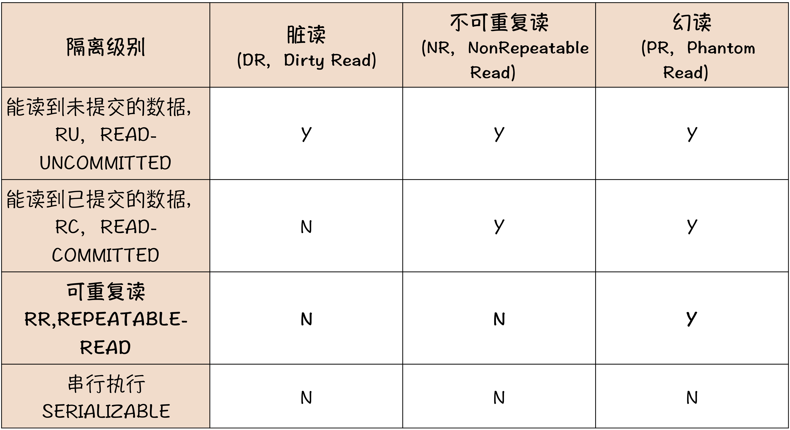

# ✅MySQL中的事务隔离级别？
<!--page header-->

# 典型回答

SQL-92 标准还定义了 4 种隔离级别来解决脏读、幻读、不可重复读等这些异常情况，从高到底依次为：可串行化(Serializable)、可重复读(Repeatable reads)、提交读(Read committed)、未提交读(Read uncommitted)。

**未提交读(Read uncommitted)**是最低的隔离级别。通过名字我们就可以知道，在这种事务隔离级别下，一个事务可以读到另外一个事务未提交的数据。这种隔离级别下会存在幻读、不可重复读和脏读的问题。

**提交读(Read committed)**也可以翻译成读已提交，通过名字也可以分析出，在一个事务修改数据过程中，如果事务还没提交，其他事务不能读该数据。所以，这种隔离级别是可以避免脏读的发生的。

**可重复读(Repeatable reads)**，由于提交读隔离级别会产生不可重复读的读现象。所以，比提交读更高一个级别的隔离级别就可以解决不可重复读的问题。这种隔离级别就叫可重复读。但是这种隔离级别没办法彻底解决幻读。

**可串行化(Serializable)**是最高的隔离级别，前面提到的所有的隔离级别都无法解决的幻读，在可串行化的隔离级别中可以解决。

注意！！！以上是SQL-92标准中对事务隔离级别以及需要解决的读现象（脏读、幻读、不可重复读）的定义，但是不同的数据库在实际实现的过程中，是有一些细微差异的。

# 扩展知识

## 事务隔离级别相关命令

1.查看当前会话隔离级别

`select @@tx_isolation;`

在MySQL 8.0中：`SELECT @@transaction_isolation;`

2.查看系统当前隔离级别

`select @@global.tx_isolation;`

3.设置当前会话隔离级别

`set session transaction isolatin level repeatable read;`

4.设置系统当前隔离级别

`set global transaction isolation level repeatable read;`

5.命令行，开始事务时

`set autocommit=off 或者 start transaction`

## 为什么MySQL默认的事务隔离级别是RR？

[为什么MySQL默认使用RR隔离级别？](https://www.yuque.com/hollis666/axzrte/fx5luearutigdcep?view=doc_embed)

<!--page footer-->
- 原文: <https://www.yuque.com/hollis666/axzrte/ytxaew>