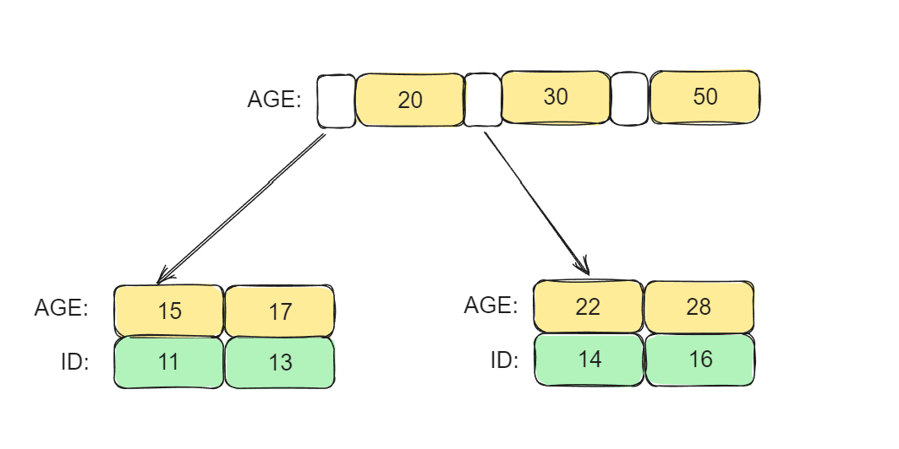

# ✅什么是聚簇索引和非聚簇索引？
<!--page header-->

# 典型回答
聚簇索引（Clustered Index）和非聚簇索引（Non-clustered Index）是数据库中的两种索引类型，它们在组织和存储数据时有不同的方式。

**聚簇索引**，简单点理解就是将数据与索引放到了一起，找到索引也就找到了数据。也就是说，对于聚簇索引来说，他的非叶子节点上存储的是索引字段的值，而他的叶子节点上存储的是这条记录的整行数据。

**在InnoDB中，聚簇索引（Clustered Index）指的是按照每张表的主键构建的一种索引方式**，它是将表数据按照主键的顺序存储在磁盘上的一种方式。这种索引方式保证了行的物理存储顺序与主键的逻辑顺序相同，因此查找聚簇索引的速度非常快。

**非聚簇索引**，就是将数据与索引分开存储，叶子节点包含索引字段值及指向数据页数据行的逻辑指针。

**在Innodb中，非聚簇索引（Non-clustered Index）是指根据非主键字段创建的索引**，也就是通常所说的二级索引。它不影响表中数据的物理存储顺序，而是单独创建一张索引表，用于存储索引列和对应行的指针。

在InnoDB中，主键索引就是聚簇索引，而非主键索引，就是非聚簇索引，所以在InnoDB中：

- **对于聚簇索引来说，他的非叶子节点上存储的是索引值，而它的叶子节点上存储的是整行记录。**
- **对于非聚簇索引来说，他的非叶子节点上存储的都是索引值，而它的叶子节点上存储的是主键的值+索引值。**

**所以，通过非聚簇索引的查询，需要进行一次回表，就是先查到主键ID，在通过ID查询所需字段。**

[✅什么是回表，怎么减少回表的次数？](https://www.yuque.com/hollis666/axzrte/vr22wd?view=doc_embed)

## 没有创建主键怎么办？

我们知道，Innodb中的聚簇索引是按照每张表的主键构造一个B+树，那么不知道大家有没有想过这个问题，如果我们在表结构中没有定义主键，那怎么办呢？

其实，数据库中的每行记录中，除了保存了我们自己定义的一些字段以外，还有一些重要的 db_row_id字段，其实他就是一个数据库帮我添加的隐藏主键，如果我们没有给这个表创建主键，会选择一个不为空的唯一索引来作为聚簇索引，但是如果没有合适的唯一索引，那么会以这个隐藏主键来创建聚簇索引。 

<!--page footer-->
- 原文: <https://www.yuque.com/hollis666/axzrte/le8gbo472cpxv63z>