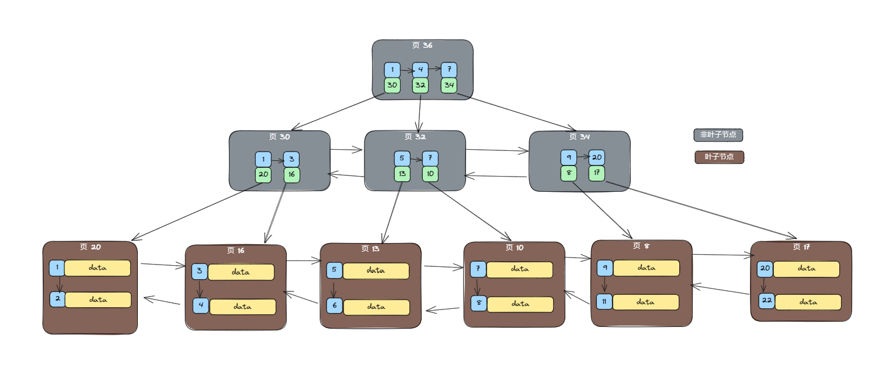
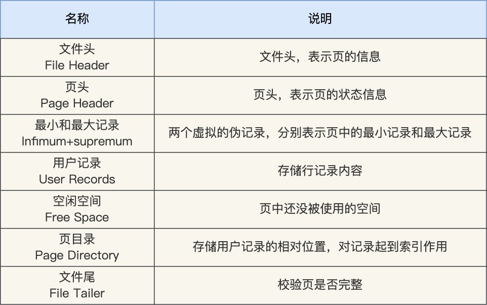

# ✅介绍一下InnoDB的数据页，和B+树的关系是什么？
<!--page header-->

# 典型回答

**InnoDB的数据页是InnoDB存储引擎中用于存储数据的基本单位。**它是磁盘上的一个连续区域，通常大小为16KB当然，也可以通过配置进行调整。16KB就意味着Innodb的每次读写都是以 16KB 为单位的，一次从磁盘到内存的读取的最小是16KB，一次从内存到磁盘的持久化也是最小16KB。

B+树的每个节点都对应着一个数据页，包括根节点、非叶子节点和叶子节点。B+树通过节点之间的指针连接了不同层级的数据页，从而构建了一个有序的索引结构。

通过B+树的搜索过程，可以从根节点开始逐层遍历，最终到达叶子节点，找到所需的数据行。

所以，数据页是存储数据行的实际物理空间，以页为单位进行磁盘读写操作。B+树通过节点和指针的组织，构建了一个层次结构的索引，用于快速定位和访问数据行。

B+树的非叶子节点对应着数据页，其中存储着主键+指向子节点（即其他数据页）的指针。B+树的叶子节点包含实际的数据行，每个数据行存储在一个数据页中。

通过这种方式，InnoDB利用B+树和数据页的组合，实现了高效的数据存储和检索。B+树提供了快速的索引查找能力，而数据页提供了实际存储和管理数据行的机制。它们相互配合，使得InnoDB能够处理大规模数据的高效访问。

# 扩展知识

## 数据页的构成

一个数据页中包含了7个部分，分别是文件头、页头、最小和最大记录、用户记录、空闲空间、页目录以及文件尾。

<!--page footer-->
- 原文: <https://www.yuque.com/hollis666/axzrte/vebvlntlc6rnvuu0>