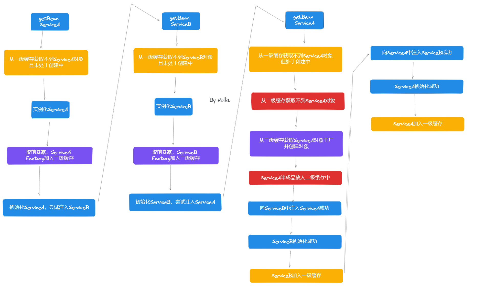

# ✅三级缓存是如何解决循环依赖的问题的？
<!--page header-->

<a name="WaWBi"></a>
# 典型回答

**Spring中Bean的创建过程其实可以分成两步，第一步叫做实例化，第二步叫做初始化。**

实例化的过程只需要调用构造函数把对象创建出来并给他分配内存空间，而初始化则是给对象的属性进行赋值。

而Spring之所以可以解决循环依赖就是因为对象的初始化是可以延后的，也就是说，当我创建一个Bean ServiceA的时候，会先把这个对象实例化出来，然后再初始化其中的serviceB属性。

```sql
@Service
public class ServiceA{

	@Autowired
	private ServiceB serviceB;

}


@Service
public class ServiceB{

	@Autowired
	private ServiceA serviceA;

}
```

而当一个对象只进行了实例化，但是还没有进行初始化时，我们称之为**半成品对象**。所以，所谓半成品对象，其实只是 bean 对象的一个空壳子，还没有进行属性注入和初始化。

当两个Bean在初始化过程中互相依赖的时候，如初始化A发现他依赖了B，继续去初始化B，发现他又依赖了A，那这时候怎么办呢？大致流程如下：




通过以上方式，就通过引入三级缓存，解决了循环依赖的问题，在上述流程执行完之后，ServiceA和ServiceB都被成功的完成了实例化和初始化。

以下是DefaultSingletonBeanRegistry#getSingleton方法，代码中，包括一级缓存、二级缓存、三级缓存的处理逻辑，该方法是获取bean的单例实例对象的核心方法：

```
@Nullable
protected Object getSingleton(String beanName, boolean allowEarlyReference) {
    // 首先从一级缓存中获取bean实例对象，如果已经存在，则直接返回
    Object singletonObject = this.singletonObjects.get(beanName);
    if (singletonObject == null && isSingletonCurrentlyInCreation(beanName)) {
        // 如果一级缓存中不存在bean实例对象，而且当前bean正在创建中，则从二级缓存中获取bean实例对象
        singletonObject = this.earlySingletonObjects.get(beanName);
        if (singletonObject == null && allowEarlyReference) {
            // 如果二级缓存中也不存在bean实例对象，并且允许提前引用，则需要在锁定一级缓存之前，
            // 先锁定二级缓存，然后再进行一系列处理
            synchronized (this.singletonObjects) {
                // 进行一系列安全检查后，再次从一级缓存和二级缓存中获取bean实例对象
                singletonObject = this.singletonObjects.get(beanName);
                if (singletonObject == null) {
                    singletonObject = this.earlySingletonObjects.get(beanName);
                    if (singletonObject == null) {
                        // 如果二级缓存中也不存在bean实例对象，则从三级缓存中获取bean的ObjectFactory，并创建bean实例对象
                        ObjectFactory<?> singletonFactory = this.singletonFactories.get(beanName);
                        if (singletonFactory != null) {
                            singletonObject = singletonFactory.getObject();
                            // 将创建好的bean实例对象存储到二级缓存中
                            this.earlySingletonObjects.put(beanName, singletonObject);
                            // 从三级缓存中移除bean的ObjectFactory
                            this.singletonFactories.remove(beanName);
                        }
                    }
                }
            }
        }
    }
    return singletonObject;
}

```


<a name="ZN3rh"></a>
# 扩展知识

[✅Spring解决循环依赖一定需要三级缓存吗？](https://www.yuque.com/hollis666/axzrte/edvhrik3pbw300os?view=doc_embed)


<!--page footer-->
- 原文: <https://www.yuque.com/hollis666/axzrte/ffk7dlcrwk35glpl>