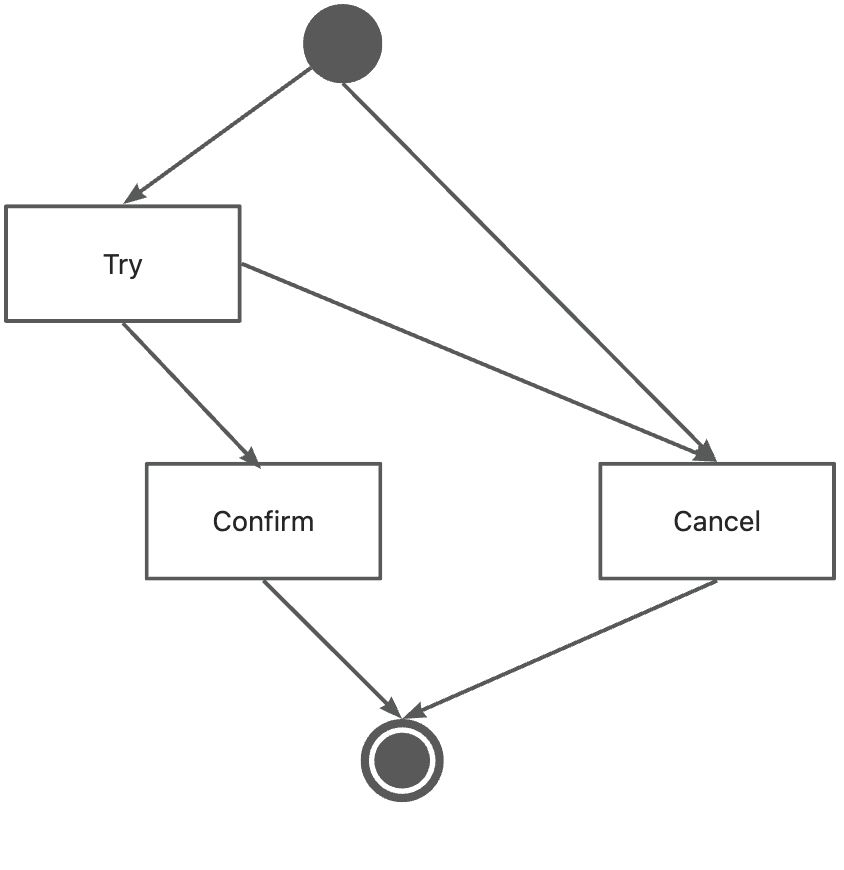

# ✅TCC的空回滚和悬挂是什么？如何解决？
<!--page header-->

<a name="FeN7y"></a>
# 典型回答

TCC是一种分布式的事务的方案，将一个事务分成了TRY-CANCEL-CONFIRM三个阶段：

[✅什么是TCC，和2PC有什么区别？](https://www.yuque.com/hollis666/axzrte/xhvbak3ouy6xqiml?view=doc_embed)

在TCC中，存在着两个比较关键的问题，那就是空回滚和悬挂的问题。

1. **空回滚问题**：TCC中的Try过程中，有的参与者成功了，有的参与者失败了，这时候就需要所有参与者都执行Cancel，这时候，对于那些没有Try成功的参与者来说，本次回滚就是一次空回滚。需要在业务中做好对空回滚的识别和处理，否则就会出现异常报错的情况，甚至可能导致Cancel一直失败，最终导致整个分布式事务失败。
2. **悬挂事务问题**：TCC的实现方式存在悬挂事务的问题，在调用TCC服务的一阶段Try操作时，可能会出现因网络拥堵而导致的超时，此时事务协调器会触发二阶段回滚，调用TCC服务的Cancel操作；在此之后，拥堵在网络上的一阶段Try数据包被TCC服务收到，出现了二阶段Cancel请求比一阶段Try请求先执行的情况。举一个比较常见的具体场景：一次分布式事务，先发生了Try，但是因为有的节点失败，又发生了Cancel，而下游的某个节点因为网络延迟导致先接到了Cancel，在空回滚完成后，又接到了Try的请求，然后执行了，这就会导致这个节点的Try占用的资源无法释放，也没人会再来处理了，就会导致了事务悬挂。

这两个问题处理不好，都可能会导致一个分布式事务没办法保证最终一致性。有一个办法，可以一次性的解决以上两个问题，那就是——引入分布式事务记录表。

有了这张表，每一个参与者，都可以在本地事务执行的过程中，同时记录一次分布式事务的操作记录。

这张表中有两个关键的字段，一个是tx_id用于保存本次处理的事务ID，还有一个就是state，用于记录本次事务的执行状态。至于其他的字段，比如一些业务数据，执行时间、业务场景啥的，就自己想记录上就记录啥。

```
CREATE TABLE `distribute_transaction` (
  `tx_id` varchar(128) NOT NULL COMMENT '事务id',
  `state` int(1) DEFAULT NULL COMMENT '事务状态，0:try，1:confirm，2:cancel',
  PRIMARY KEY (`tx_id`) U
) 
```

有了这张表以后，我们在做try、cancel和confirm操作之后，都需要在本地事务中创建或者修改这条记录。一条记录的状态机如下：



**空回滚解决**：当一个参与者接到一次Cancel请求的时候，先去distribute_transaction表中根据tx_id查询是否有try的记录，如果没有，则进行一次空回滚即可。并在distribute_transaction中创建一条记录，状态标记为cancel。

**事务悬挂解决**：当一个参与者接到一次Try请求的时候，先去distribute_transaction表中根据tx_id查询是否有记录，如果当前存在，并且记录的状态是cancel，则拒绝本次try请求。

但是需要注意的是，上面的请求过程，需要做好并发控制。

有了这张表，我们还可以基于他做幂等控制，每次try-cancel-confirm请求来的时候，都可以到这张表中查一下，然后做幂等控制。


<!--page footer-->
- 原文: <https://www.yuque.com/hollis666/axzrte/cu01a1g1xxn2v52u>