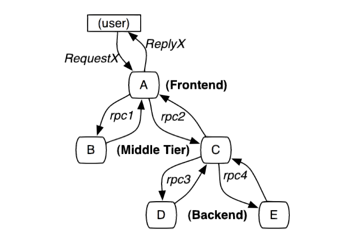
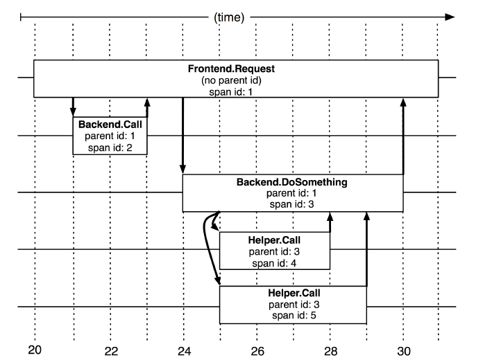

# ✅如何实现应用中的链路追踪？
<!--page header-->

# 典型回答

随着业务量的增长，为了提升整体系统的可用性、性能及可扩展性，很多大型互联网公司都会采用微服务架构，一次业务请求，一般要经过几个微服务调用才能完成，。

一次请求之间要经过很多的系统，那么如何追踪一次请求从头到尾的流程，就至关重要，这样可以帮我们做很好的链路分析，及问题定位。

在业内，有很多链路追踪的工具，如Google的dapper、twitter的zipkin、京东的hydra、大众点评的cat，以及开源的skywalking。建议大家看看Google的这篇论文，可以说它是分布式链路追踪的启蒙之作：[https://bigbully.github.io/Dapper-translation/](https://bigbully.github.io/Dapper-translation/) 

不管是哪个实现，在我看来重点就是解决两个问题：

1、生成一个全局的traceId
2、把这个traceId传递下去

### 生成TraceId

想要追踪一个完成的链路，就需要有一个标识来标记这次调用链，业内把他叫做traceId，一般会在入口处生成一个全局唯一的traceId，比如说在HTTP的请求入口，在定时任务的调度入口等，生成一个traceId。

### 传递TraceId

在有了一个traceId之后，想要通过它把一次调用过程串联起来，那么就需要所有的系统间调用都得把他传递下去，这里面的调用包括了HTTP请求、RPC请求、MQ消息等，甚至还需要涉及到Redis、MySQL等等可能都需要进行传递。

所以，想要实现一个链路追踪，需要很多中间件一起配合才行，通常这个traceId会存放在RPC的请求头、HTTP的请求头、MQ消息的消息头中进行传递。

系统之间通过这种方式，那系统内部也是需要传递的，所以一般都是用ThreadLocal来实现的，在接收到请求后，会把这个traceId存储在ThreadLocal中，然后就能在当前线程中一直传递下去，并且在记录日志的时候取出来打印到日志中，在需要调远程的时候，取出来传递下去。

但是，如果有多线程怎么办呢？ThreadLocal咋传递呢，这就要用到TTL了：

[✅有了InheritableThreadLocal为啥还需要TransmittableThreadLocal？](https://www.yuque.com/hollis666/axzrte/fucuuyqoqv8rdkpr?view=doc_embed)

# 扩展知识

## Span

前面提到了traceId，其实光有traceId还不够，trace帮我们把一次调用串联起来，但是一次调用在每一个系统上都干了什么，干了多久，成功还是失败，这些对我们来说也很重要，这些信息就被记录在span中。

通常一个完整的 Span 具有如下属性：

- Operation Name：描述了当前接口的行为语义，如具体的哪个接口，哪个URL地址。
- SpanId/ParentSpanId：接口调用的层级标识，用于还原 Trace 内部的层次调用关系。
- Start/FinishTime：接口调用的开始和结束时间，二者相减就是该次调用的耗时。
- StatusCode：响应状态，标识当次调用是成功或失败。
- Tags & Events：调用附加信息

### 

<!--page footer-->
- 原文: <https://www.yuque.com/hollis666/axzrte/nnl88aqknhx2v76c>