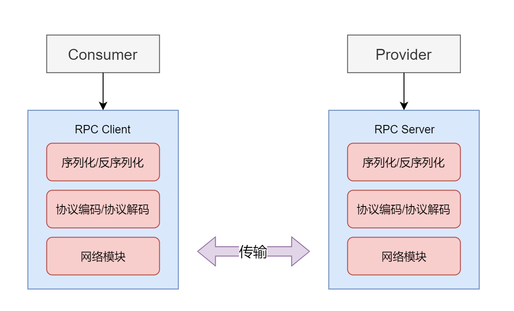

# ✅一次RPC请求，服务端显示超时，但是客户端不超时，可能是什么原因？
<!--page header-->

# 典型回答

我们都知道，一次RPC调用是从服务端发起，然后请求到客户端，再响应给服务端的过程。

一般来说，一次调用过程中，主要的耗时都是在客户端的同步代码执行上。但是，有的时候，会非常诡异的出现服务端显示超时，但客户端并未超时的情况。

一般就是服务端通过监控报警报出来某个接口存在超时（比如超过3000ms还没返回），然后对应的接口提供者，他通过查看监控，以及查看自己的日志发现自己并没有超时（比如200ms就返回了）。

那么，如果出现这个现象，可能是什么原因呢？

1. **网络延迟或丢包（主要）**：一起请求的RT除了包括客户端的执行时长以外，还有一个重要的部分那就是网络交互的时长，而如果存在网络问题，那么可能导致请求在传输过程中延迟或丢失。如果服务端在处理请求之前或处理过程中遇到网络延迟，可能会导致实际处理时间超出预期，从而触发服务端的超时机制。

这种是最常见的一种情况，可以通过查看TCP重传率来查看服务端及客户端的网络是否存在延迟的情况。

[✅什么是TCP重传率，有什么用？如何查看？](https://www.yuque.com/hollis666/axzrte/tk8w4sg1gw9cd0gg?view=doc_embed)

2. **服务端和客户端超时配置不一致（主要）**：RPC调用通常既有客户端的超时设置，也有服务端的超时设置。如果服务端的超时阈值设置得比客户端的超时阈值更低（即服务端配置2000ms超时，但是客户端配置的是3000ms超时），那么即使客户端没有超时，服务端也可能因为超过其自身的超时阈值而报告超时。

3. **服务端处理能力（次要）**：如果服务端在处理请求时遇到资源瓶颈（如CPU、内存限制）或者服务端正在处理大量的并发请求，可能会导致某些请求处理时间较长，从而触发出现超时的现象。

<!--page footer-->
- 原文: <https://www.yuque.com/hollis666/axzrte/gl5n4ovgyauybtnz>