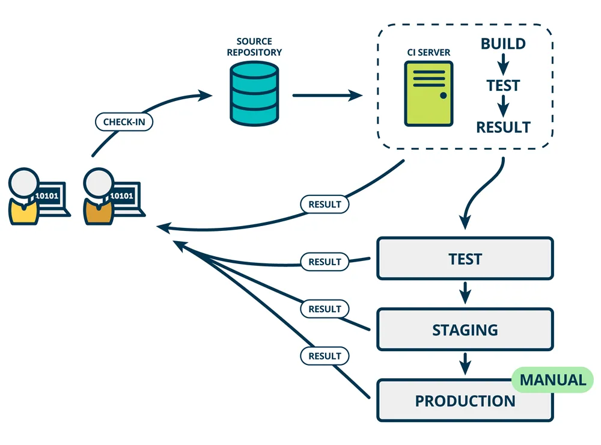
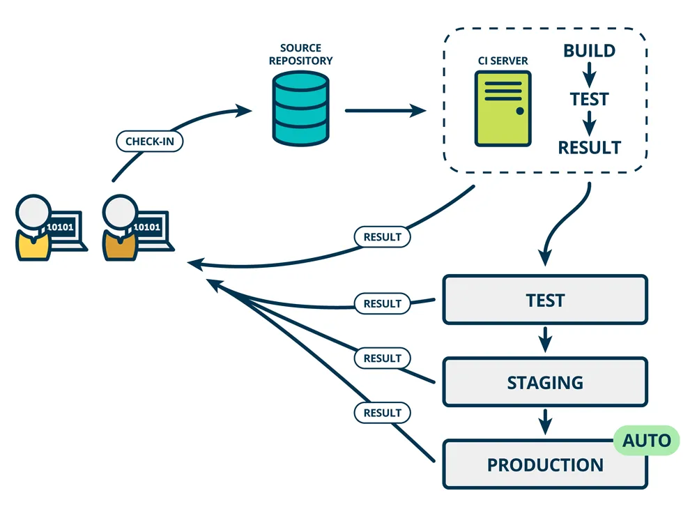

# ✅微服务中的CI/CD了解吗？
<!--page header-->

# 典型回答

CI是Continuous Integration，翻译过来是持续集成，CD可以是Continuous Delivery也可以是Continuous Deployment，翻译过来分别是持续交付和持续部署。

**持续集成**

持续集成是一种软件开发实践，要求开发者经常集成其变更，方式是将变更合并到主干（trunk）。

持续集成通常通过自动化的构建判定多个变更是否已就绪来实现，也就是说，持续集成可以快速地决定一组变更是否可部署，也可以检测到应用内容的遗漏，包括代码错误、缺失的文件，以及**单元测试**中潜在的错误。

持续集成强调开发人员提交了新代码之后，立刻进行构建、（单元）测试。根据测试结果，我们可以确定新代码和原有代码能否正确地集成在一起。

**持续交付**

持续交付（CD）是一种软件开发实践，旨在早期、快速、可靠地发布高质量软件，以满足业务需求。

持续交付构建、测试和部署系统，这些步骤综合在一起以实现及时部署，包括自动化测试、可跟踪性和可扩展性，以及触发维护活动时的预警。

持续交付在持续集成的基础上，将集成后的代码部署到更贴近真实运行环境的「类生产环境」（production-like environments）中。比如，我们完成单元测试后，可以把代码部署到连接数据库的 Staging 环境中更多的测试。如果代码没有问题，可以继续手动部署到生产环境中。

**持续部署**

持续部署（CD）指的是在持续集成完成后，直接向生产环境部署应用，或者是定期将新功能部署到生产环境的过程。

持续部署通常需要由一组自动化步骤来实现，比如云计算，必要的负载均衡和其它依赖准备工作。

持续部署则是在持续交付的基础上，把部署到生产环境的过程自动化。

<!--page footer-->
- 原文: <https://www.yuque.com/hollis666/axzrte/zred7qql7p76wf5d>