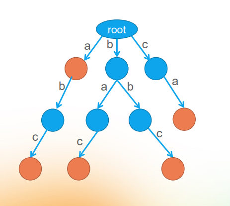

# ✅什么是前缀树，有什么作用？
<!--page header-->

<a name="QSCRb"></a>
# 典型回答
所谓前缀树，也叫字典树，是一种变种的多叉树。
举个例子：有以下字符串：
abc,bac,bbc,ca，
通过字典树形成的结构如下所示：

从上图我们可以看出，通过字典树，在查询的时候，原来的时间复杂度是O(n*m)，优化后的时间复杂度就会变成O(m)。同时，如果有很多字符串，字典树还可以大大减少存储的空间
字典树的java实现如下所示：
```java
class Trie {

    private Trie[] children;

    private boolean isWord;

    public Trie() {
        this.isWord = false;
        this.children = new Trie[26];
    }
    
    public void insert(String word) {
        Trie next = this;
        for(char c : word.toCharArray()) {
            if(next.children[c - 'a'] == null) {
                next.children[c - 'a'] = new Trie();
            }
            next = next.children[c - 'a'];
        }
        next.isWord = true;
    }
    
    public boolean search(String word) {
        Trie next = this;
        for(char c : word.toCharArray()) {
            if(next.children[c - 'a'] == null) {
                return false;
            }
            next = next.children[c - 'a'];
        }
        return next.isWord;
    }
    
    public boolean startsWith(String prefix) {
        Trie next = this;
        for(char c : prefix.toCharArray()) {
            if(next.children[c - 'a'] == null) {
                return false;
            }
            next = next.children[c - 'a'];
        }
        return true;
    }
}
```
<a name="qCV54"></a>
# 知识扩展
<a name="WfPT7"></a>
## 前缀树有哪些应用？
<a name="AUTIA"></a>
### 字符串检索
给出N 个单词组成的熟词表，以及一篇全用小写英文书写的文章，请你按最早出现的顺序写出所有不在熟词表中的生词。
<a name="suTqr"></a>
### 字符串最长公共前缀
给出N 个小写英文字母串，以及Q 个询问，即询问某两个串的最长公共前缀的长度是多少？
<a name="fCGYf"></a>
### 排序
Trie树是一棵多叉树，只要先序遍历整棵树，输出相应的字符串便是按字典序排序的结果。比如给你N 个互不相同的仅由一个单词构成的英文名，让你将它们按字典序从小到大排序输出。
<a name="RWHnR"></a>
### 作为其他数据结构和算法的辅助结构
如后缀树，AC自动机等
<a name="onmT5"></a>
### 词频统计
trie树在这里的应用类似哈夫曼树，比如词频统计使用哈希表或者堆都可以，但是如果内存有限，就可以用trie树来压缩空间，因为trie树的公共前缀都是用一个节点保存的。
<a name="tlVfG"></a>
### 字符串搜索的前缀匹配
trie树常用于搜索提示。如当输入一个网址，可以自动搜索出可能的选择。当没有完全匹配的搜索结果，可以返回前缀最相似的可能。


<!--page footer-->
- 原文: <https://www.yuque.com/hollis666/axzrte/waqku6qab64aow90>