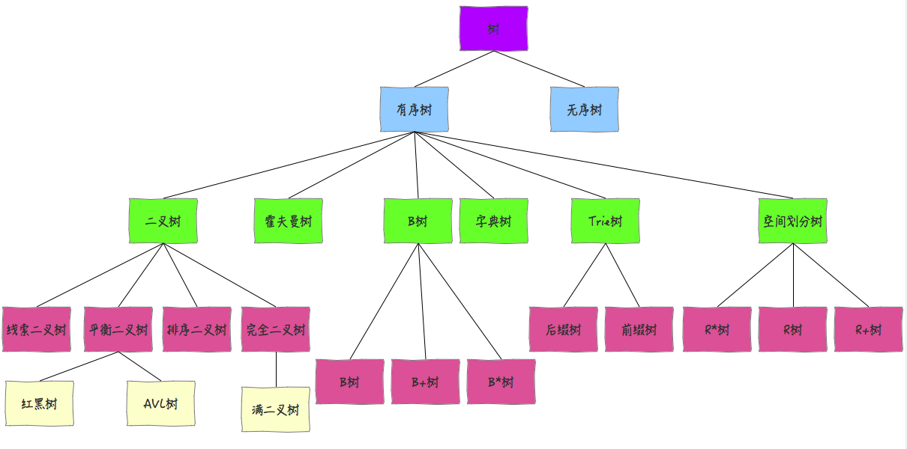

# 🔜什么是树？了解哪些树结构？
<!--page header-->

# 典型回答
从定义上来说，所谓的树，就是由节点和边组成，且不存在环的一种数据结构。
从实现上来讲，树一般通过链表来实现。
从结构上分，树可分为二叉树和多叉树。一般我们在写算法的时候，使用二叉树和字典树比较多。

除此之外，

1. B*树一般用于数据库的索引，特点是由多个子树，高度很低，可以减少磁盘IO；
2. 霍夫曼树一般通过哈夫曼编码做数据的无损压缩；（这个是大学数据结构的必修内容，但是面试一般不考）
3. 红黑树和平衡二叉树因为是有序的，所以经常用于二分查找，红黑树相对于平衡二叉树的优点是，不要求树完全平衡，这就会降低数据更新时候的时间复杂度。Java中的HashMap就会通过红黑树来进行查找；
4. 字典树一般是针对一组字符串进行维护的数据结构，它可以将共同前缀的字符串进行优化，节省存储空间，同时可以快速查询某个字符串是否出现。（在LeetCode Hard中比较常见）

树的分类如下所示：

> - 注意：上图中的字典树就是Tire树，

# 知识扩展

## 二叉查找树的演变和区别？
参考该文章中第二条：[为什么是红黑树](https://www.yuque.com/hollis666/axzrte/zx609g)
[✅为什么在JDK8中HashMap要转成红黑树](https://www.yuque.com/hollis666/axzrte/zx609g)

## 什么是字典树？
[✅什么是前缀树，有什么作用？](https://www.yuque.com/hollis666/axzrte/waqku6qab64aow90?view=doc_embed)

<!--page footer-->
- 原文: <https://www.yuque.com/hollis666/axzrte/ga0ea3auaoqrxnzq>