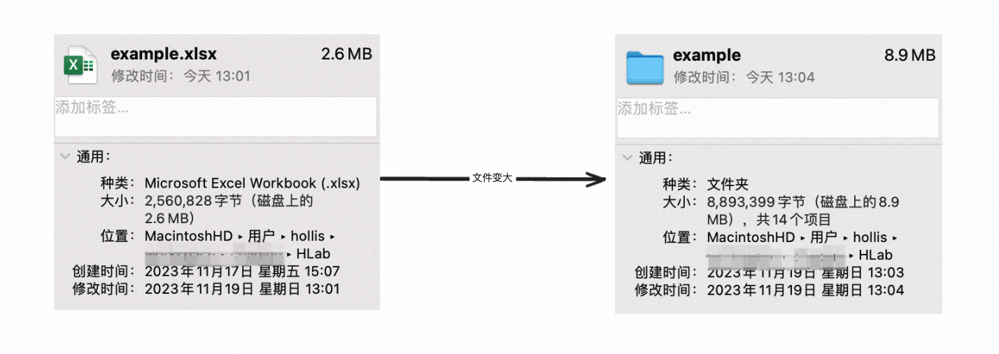

# ✅什么是POI，为什么它会导致内存溢出？
<!--page header-->

<a name="wFjyN"></a>
# 典型回答

Apache POI，是一个非常流行的文档处理工具，通常大家会选择用它来处理Excel文件。但是在实际使用的时候，经常会遇到内存溢出的情况，那么，为啥他会导致内存溢出呢？

<a name="eWTZ6"></a>
### Excel并没看到的那么小

我们通常见到的xlsx文件，其实是一个个压缩文件。它们把若干个XML格式的纯文本文件压缩在一起，Excel就是读取这些压缩文件的信息，最后展现出一个完全图形化的电子表格。

所以，如果我们把xlsx文件的后缀更改为.zip或.rar，再进行解压缩，就能提取出构成Excel的核心源码文件。解压后会发现解压后的文件中有3个文件夹和1个XML格式文件：


> _rels 文件夹 看里面数据像是一些基础的配置信息,比如 workbook 文件的位置等信息,一般不会去动它.
> 
> docProps 文件夹 docProps 文件夹下重要的文件是一个 app.xml,这里面主要存放了 sheet 的信息,如果想添加或编辑 sheet 需要改这个文件.其他文件都是一些基础信息的数据,比如文件所有者,创建时间等.
> 
> xl 文件夹 xl 文件夹是最重要的一个文件夹,里面存放了 Sheet 中的数据,行和列的格式,单元格的格式,sheet 的配置信息等等信息.


所以，实际上我们处理的xlsx文件实际上是一个经过高度压缩的文件格式，背后是有好多文件支持的。所以，我们看到的一个文件可能只有2M，但是实际上这个文件未压缩情况下可能要比这大得多。



也就是说，POI在处理的时候，处理的实际上并不只是我们看到的文件大小，实际上他的大小大好几倍。

**这是为什么明明我们处理的文件只有100多兆，但是实际却可能占用1G内存的其中一个原因。当然这只是其中一个原因，还有一个原因，我们就需要深入到POI的源码中来看了。**

<a name="vGpZL"></a>
### POI的溢出原理

我们拿POI的文件读取来举例，一般来说文件读取出现内存溢出的情况更多一些。以下是一个POI文件导出的代码示例：

```java
import org.apache.poi.ss.usermodel.*;
import org.apache.poi.xssf.usermodel.XSSFWorkbook;

import java.io.File;
import java.io.FileInputStream;
import java.io.IOException;

public class ExcelReadTest {

    public static void main(String[] args) {
        // 指定要读取的文件路径
        String filename = "example.xlsx";

        try (FileInputStream fileInputStream = new FileInputStream(new File(filename))) {
            // 创建工作簿对象
            Workbook workbook = new XSSFWorkbook(fileInputStream);

            // 获取第一个工作表
            Sheet sheet = workbook.getSheetAt(0);

            // 遍历所有行
            for (Row row : sheet) {
                // 遍历所有单元格
                for (Cell cell : row) {
                    Thread.sleep(100);
                    // 根据不同数据类型处理数据
                    switch (cell.getCellType()) {
                        case STRING:
                            System.out.print(cell.getStringCellValue() + "\t");
                            break;
                        case NUMERIC:
                            if (DateUtil.isCellDateFormatted(cell)) {
                                System.out.print(cell.getDateCellValue() + "\t");
                            } else {
                                System.out.print(cell.getNumericCellValue() + "\t");
                            }
                            break;
                        case BOOLEAN:
                            System.out.print(cell.getBooleanCellValue() + "\t");
                            break;
                        case FORMULA:
                            System.out.print(cell.getCellFormula() + "\t");
                            break;
                        default:
                            System.out.print(" ");
                    }
                }
                System.out.println();
            }
        } catch (IOException e) {
            e.printStackTrace();
        } catch (InterruptedException e) {
            throw new RuntimeException(e);
        }
    }

}

```

这里面用到了一个关键的XSSFWorkbook类，

```java
public XSSFWorkbook(InputStream is) throws IOException {
    this(PackageHelper.open(is));
}

public static OPCPackage open(InputStream is) throws IOException {
    try {
        return OPCPackage.open(is);
    } catch (InvalidFormatException e){
        throw new POIXMLException(e);
    }
}
```

最终会调用到OPCPackage.open方法，看看这个方法是咋实现的：

```java
/**
 * Open a package.
 *
 * Note - uses quite a bit more memory than {@link #open(String)}, which
 * doesn't need to hold the whole zip file in memory, and can take advantage
 * of native methods
 *
 * @param in
 *            The InputStream to read the package from
 * @return A PackageBase object
 *
 * @throws InvalidFormatException
 * 				Throws if the specified file exist and is not valid.
 * @throws IOException If reading the stream fails
 */
public static OPCPackage open(InputStream in) throws InvalidFormatException,
        IOException {
    OPCPackage pack = new ZipPackage(in, PackageAccess.READ_WRITE);
    try {
        if (pack.partList == null) {
            pack.getParts();
        }
    } catch (InvalidFormatException | RuntimeException e) {
        IOUtils.closeQuietly(pack);
        throw e;
    }
    return pack;
}
```

这行代码的注释中说了：这个方法会把整个压缩文件都加载到内存中。也就是把整个 Excel 文档加载到内存中，可想而知，这在处理大型文件时是肯定会导致导致内存溢出的。

也就是说我们使用的XSSFWorkbook（包括HSSFWorkbook也同理）在处理Excel的过程中会将整个Excel都加载到内存中，在文件比较大的时候就会导致内存溢出。

<a name="mSUt6"></a>
# 扩展知识
<a name="Hv1g0"></a>
## 几种Workbook格式

POI中提供了很多种WorkBook API来操作Excel，有的适合大文件读写，有的不适合。

**SSFWorkbook**

- 用于处理 Excel 的 .xls 格式（即 Excel 97-2003）。

**XSSFWorkbook**

- 用于处理 Excel 的 .xlsx 格式（即 Excel 2007 及以后版本的）。支持更大的数据集和更多的功能，如更好的样式和公式支持。但是相对于 HSSFWorkbook，它在处理大数据集时可能占用更多内存。

**SXSSFWorkbook**

- 用于处理 .xlsx 格式。它是 XSSFWorkbook 的流式版本，专门设计用于处理大数据集。通过将数据写入临时文件而非全部保留在内存中，显著减少内存消耗。特别适合用于创建大型数据集的 Excel 文件。


<a name="mZvCb"></a>
## 几种Workbook性能对比

[✅POI的如何做大文件的写入](https://www.yuque.com/hollis666/axzrte/kalmkdx5fukxt13q?view=doc_embed)


<!--page footer-->
- 原文: <https://www.yuque.com/hollis666/axzrte/gcxwx1gnimfyamvw>