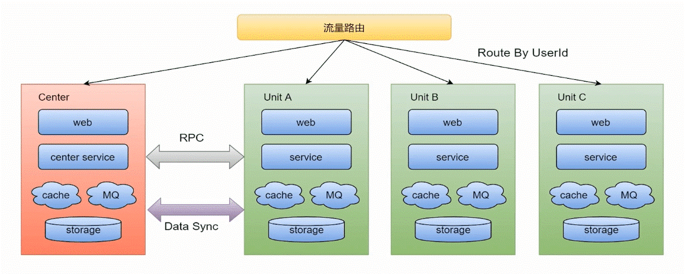

# ✅什么是单元化架构？
<!--page header-->

# 典型回答

所谓单元，是指一个能完成所有业务操作的自包含集合，在这个集合中包含了所有业务所需的所有服务，以及分配给这个单元的数据。

单元化架构就是把单元作为系统部署的基本单位，在全站所有机房中部署数个单元，每个机房里的单元数目不定，任意一个单元都部署了系统所需的所有的应用，数据则是全量数据按照某种维度划分后的一部分。

所以，在单元化架构中，分成很多个单元和一个中心。每个单元之间都是相互独立的。一个单元中完整的部署了一整套业务，如电商交易，金融支付，一次用户操作可以在一个单元内部完成，不需要跨单元执行。

但是如果从数据角度来说， 单元内的数据又不是完整的，他只包含这个单元内的数据，其他的单元的数据他是没有的。

所以，多个单元组合在一起，数据才是完整的。比如我们可以把一个淘宝， 分成3个单元，如上海单元、北京单元和新加坡单元。

这样，一个杭州的用户下单，就可以直接路由到上海单元，并且在这个单元内把所有流程都走完，一个美国的用户下单，就会路由到新加坡单元，并在这个单元完成所有操作。并且杭州的用户的数据只在上海单元中有，美国用户的数据只保存在新加坡单元中。

除了单元以外， 一般还有一个中心的概念，中心的数据就是全量的，所有单元的数据的聚合在一起，都存放在中心上，也会有一部分用户可以路由到中心进行业务操作。

做了单元化以后，一次下单要经过的交易系统、支付系统、数据库、缓存、MQ等等，这些都是在本单元内部独立部署的，所有的请求都不需要跨单元，在单元内部封闭执行完成，可以大大的**降低网络的延迟**。

并且，做了单元化以后非常方便的扩容，可以在单元内部快速扩容，不会影响到其他单元，也可以直接增加一个新的单元。都有非常好的**扩展性**。

做了多单元之后，就可以天然实现异地多活，具有很好的**容灾性**。在用户访问的时候，就可以就近原则，可以得到更**快地响应**。

当然，单元化也存在一些问题和限制：

1、单元化需要全链路改造，在整个环节中，如有一个环节没有做单元化改造，这种情况这个节点就只有中心。那么网络交互就一定会跨单元，跨单元就会带来更多的网络延迟。并且从这个节点开始，后面的所有请求也都只能在中心完成了。

2、每个单元都不是完整数据，这就会使得如果用户的路由没做好，就会导致用户的数据跨单元访问后获取不到数据。如果做得好，一个用户只会固定访问一个单元，那么就可能要打破就近原则，比如一个杭州的用户出差美国之后，还会路由到上海单元，那就会访问非常慢。如果给他路由到新加坡单元，速度是快了，但是数据可能没有。

3、成本，这个架构方案，成本巨高。所以只在一些大厂中才会采用，并且即使是这些大厂，也没有所有应用都做了单元化改造。并且会衍生出类似强单元化、弱单元化、非单元化等链路，会让这个系统更加的复杂。

<!--page footer-->
- 原文: <https://www.yuque.com/hollis666/axzrte/eys76h45ig2g74o3>