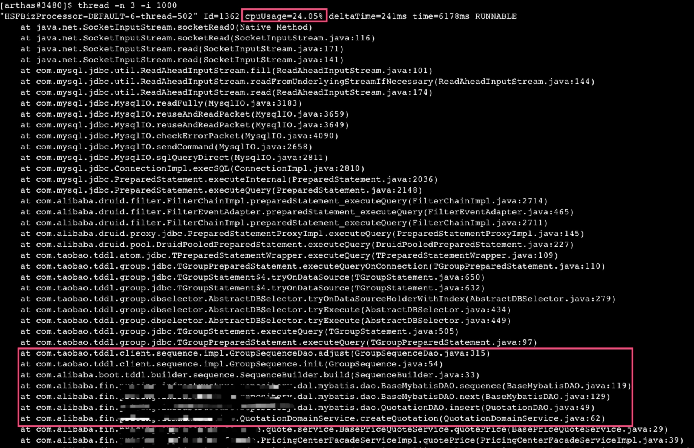
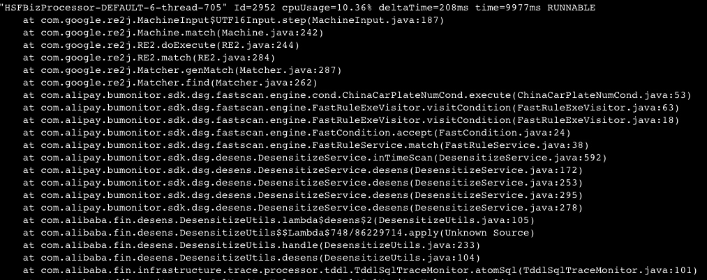

# ✅CPU飙高问题排查过程（1）
<!--page header-->

[✅什么是CPU利用率？怎么算的？](https://www.yuque.com/hollis666/axzrte/hhmxp4xri441moiq?view=doc_embed)

<a name="HOnKn"></a>
### 问题发现

前段时间我们新上了一个新的应用，因为流量一直不大，集群QPS大概只有5左右，写接口的rt在30ms左右。

因为最近接入了新的业务，业务方给出的数据是日常QPS可以达到2000，大促峰值QPS可能会达到1万。

所以，为了评估水位，我们进行了一次压测。压测在预发布环境执行。压测过程中发现，当单机QPS达到200左右时，接口的rt没有明显变化，但是CPU利用率急剧升高，直到被打满。


压测停止后，CPU利用率立刻降了下来。

于是开始排查是什么导致了CPU的飙高。

<a name="04bf00e3"></a>
### 问题排查与解决

在压测期间，登录到机器，开始排查问题。

本案例的排查过程使用的阿里开源的Arthas工具进行的，不使用arthas，使用JDK自带的命令也是可以。

在开始排查之前，可以先看一下CPU的使用情况，最简单的就是使用top命令直接查看：

```
top - 10:32:38 up 11 days, 17:56,  0 users,  load average: 0.84, 0.33, 0.18
Tasks:  23 total,   1 running,  21 sleeping,   0 stopped,   1 zombie
%Cpu(s): 95.5 us,  2.2 sy,  0.0 ni, 76.3 id,  0.0 wa,  0.0 hi,  0.0 si,  6.1 st
KiB Mem :  8388608 total,  4378768 free,  3605932 used,   403908 buff/cache
KiB Swap:        0 total,        0 free,        0 used.  4378768 avail Mem
   PID USER      PR  NI    VIRT    RES    SHR S  %CPU %MEM     TIME+ COMMAND  
   3480 admin     20   0 7565624   2.9g   8976 S  241.2 35.8 649:07.23 java  
   1502 root      20   0  401768  40228   9084 S   1.0  0.5  39:21.65 ilogtail
   181964 root      20   0 3756408 104392   8464 S   0.7  1.2   0:39.38 java   
   496 root      20   0 2344224  14108   4396 S   0.3  0.2  52:22.25 staragentd  
   1400 admin     20   0 2176952 229156   5940 S   0.3  2.7  31:13.13 java
   235514 root      39  19 2204632  15704   6844 S   0.3  0.2  55:34.43 argusagent
   236226 root      20   0   55836   9304   6888 S   0.3  0.1  12:01.91 systemd-journ
```

可以看到，进程ID为3480的Java进程占用的CPU比较高，基本可以断定是应用代码执行过程中消耗了大量CPU，接下来开始排查具体是哪个线程，哪段代码比较耗CPU。

首先，下载Arthas命令：

```
curl -L https://arthas.aliyun.com/install.sh | sh
```

启动

```
./as.sh
```

使用Arthas命令"thread -n 3 -i 1000"查看当前"最忙"（耗CPU）的三个线程：



通过上面的堆栈信息，可以看出，占用CPU资源的线程主要是卡在JDBC底层的TCP套接字读取上。连续执行了很多次，发现很多线程都是卡在这个地方。

通过分析调用链，发现这个地方是我代码中有数据库的insert，并且使用TDDL来创建sequence，在sequence的创建过程中需要和数据库有交互。

但是，基于对TDDL的了解，TDDL每次从数据库中查询sequence序列的时候，默认会取出1000条，缓存在本地，只有用完之后才会再从数据库获取下一个1000条序列。

按理说我们的压测QPS只有300左右，不应该这么频繁的何数据库交互才对。但是，经过多次使用arthas的查看，发现大部分CPU都耗尽在这里。

于是开始排查代码问题。最终发现了一个很傻的问题，那就是我们的sequence创建和使用有问题：

```
public Long insert(T dataObject) {

    if (dataObject.getId() == null) {
        Long id = next();
        dataObject.setId(id);
    }

    if (sqlSession.insert(getNamespace() + ".insert", dataObject) > 0) {
        return dataObject.getId();
    } else {
        return null;
    }
}

public Sequence sequence() {
    return SequenceBuilder.create()
        .name(getTableName())
        .sequenceDao(sequenceDao)
        .build();
}

/**
 * 获取下一个主键ID
 *
 * @return
 */
protected Long next() {
    try {
        return sequence().nextValue();
    } catch (SequenceException e) {
        throw new RuntimeException(e);
    }
}
```

是因为，我们每次insert语句都重新build了一个新的sequence，这就导致本地缓存就被丢掉了，所以每次都会去数据库中重新拉取1000条，但是只是用了一条，下一次就又重新取了1000条，周而复始。

于是，调整了代码，把Sequence实例的生成改为在应用启动时初始化一次。这样后面在获取sequence的时候，不会每次都和数据库交互，而是先查本地缓存，本地缓存的耗尽了才会再和数据库交互，获取新的sequence。

```
public abstract class BaseMybatisDAO implements InitializingBean {
        @Override
        public void afterPropertiesSet() throws Exception {
            sequence = SequenceBuilder.create().name(getTableName()).sequenceDao(sequenceDao).build();
        }
    }
```

通过实现InitializingBean，并且重写afterPropertiesSet()方法，在这个方法中进行Sequence的初始化。

改完以上代码，提交进行验证。通过监控数据可以看出优化后，数据库的读RT有明显下降：


sequence的写操作QPS也有明显下降：


于是我们开始了新的一轮压测，但是发现，CPU的使用率还是很高，压测的QPS还是上不去，于是重新使用Arthas查看线程的情况。



发现了一个新的比较耗费CPU的线程的堆栈，这里面主要是因为我们用到了一个联调工具，该工具预发布默认开启了TDDL的采集（官方文档中描述为预发布默认不开启TDDL采集，但是实际上会采集）。

这个工具在打印日志过程中会进行脱敏，脱敏框架会调用Google的re2j进行正则表达式的匹配。

因为我的操作中TDDL操作比较多，默认采集大量TDDL日志并且进行脱敏处理，确实比较耗费CPU。

所以，通过在预发布中关闭DP对TDDL的采集，即可解决该问题。

<a name="cb7fbe75"></a>
### 总结与思考

本文总结了一次线上CPU飙高的问题排查过程，其实问题都不难，并且还挺傻的，但是这个排查过程是值得大家学习的。

其实在之前自己排查过很多次CPU飙高的问题，这次也是按照老方法进行排查，但是刚开始并没有发现太大的问题，只是以为是流量升高导致数据库操作变多的正常现象。

期间又多方查证（通过arthas查看sequence的获取内容、通过数据库查看最近插入的数据的主键ID等）才发现是TDDL的Sequence的初始化机制有问题。

在解决了这个问题之后，以为彻底解决问题，结果又遇到了DP采集TDDL日志导致CPU飙高，最终再次解决后有了明显提升。

所以，事出反常必有妖，排查问题就是一个抽丝剥茧的过程。


<!--page footer-->
- 原文: <https://www.yuque.com/hollis666/axzrte/yp216u>