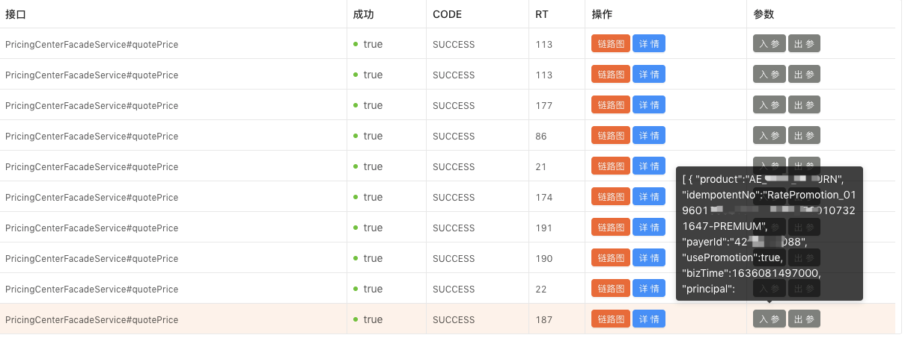
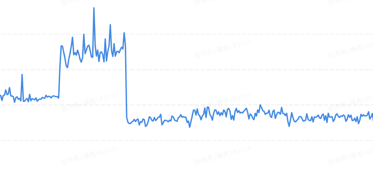

# ✅RT飙高问题排查过程
<!--page header-->

<a name="JUMn5"></a>
### 
<a name="sja3r"></a>
### 问题发现
本次是针对某个产品做风控定价的回流导入，相当于把风控策略基于风险测算出的价格通过数据同步的方式回流到我们的定价配置表中。

本次总计回流的数据大概有16万条，在此之前，我们的定价配置表中有不到2万条数据，所以，在回流之前的方案设计中，我们就考虑到可能因为数据量增大带来的一些问题了。所以，在回流过程中，我们在第一批回流了2万左右条数据之后，没有继续操作 ，开始观察线上的监控报警情况。

经过观察发现，我们的报价接口的 RT 有明显的增加，时间点和我们做数据回流的时间点刚好吻合：

<a name="K85bA"></a>
### 问题排查
所以第一时间开始排查接口的链路情况了，很明显这次 RT 升高就是因为我们的数据回流导致的，于是首先登录服务器通过 Arthas （使用手册：[https://arthas.aliyun.com/doc/index.html](https://arthas.aliyun.com/doc/index.html) ）看了下接口耗时的主要操作，验证下是不是在查询定价配置表的地方。

先下载 arthas： 

```
curl -L http://start.alibaba-inc.com/install.sh | sh
```

然后运行：
```
sh as.sh 
```

使用 trace 命令查看接口耗时：
```
[arthas@1658]$ trace com.alibaba.fin.pricing.**.PriceCalculateService trial '#cost > 50' -n 3
Press Q or Ctrl+C to abort.
Affect(class count: 1 , method count: 1) cost in 427 ms, listenerId: 6
`---ts=2021-11-08 15:10:24;thread_name=HSFBizProcessor-DEFAULT-8-thread-224;id=2d7c1;is_daemon=true;priority=10;TCCL=com.taobao.pandora.boot.loader.LaunchedURLClassLoader@783e6358;trace_id=2132e43116363554229592404e58b8;rpc_id=9.40.6
    `---[264.85838ms] com.alibaba.fin.pricing.**.service.PriceCalculateService:trial()
        +---[0.012009ms] com.alibaba.fin.pricing.**.request.PriceCalculateRequest:getTenant() #95
        +---[0.001564ms] com.alibaba.fin.pricing.**.request.PriceCalculateRequest:getProduct() #96
        ...
        ...
        ...
        +---[221.884809ms] com.alibaba.fin.pricing.*.ExercisePriceDomainService:queryMatchedEffectiveExercisePrice() #167
        +---[0.002242ms] com.alibaba.fin.pricing.**.service.PriceQueryRequest:<init>() #170
        `---[0.012586ms] com.alibaba.fin.pricing.**.service.PriceCalculateService:getTieredPrice() #170
```

经过分析发现，方法总时长264ms，其中有221ms 是耗费在ExercisePriceDomainService:queryMatchedEffectiveExercisePrice() 方法上，这个方法就是查询定价配置表获取定价配置信息的。

而且，通过 arthas监控发现，并不是所有的报价过程都是耗时很长，只有部分报价的时间比较大，还有一些是没有什么特殊变化的。

这种情况，可以继续使用 Arthas的 watch 方法，查看那些耗时比较长的请求的具体出入参，看能不能找到规律。

但是因为我们的应用接入了某联调平台，所以直接到上面看一下接口的请求情况及耗时就行了：



经过分析发现，RT 较长的请求都是归属于同一个产品的，这个产品就是本次要做千人千面定价的这个产品，其他产品的耗时没有明显变化。

这时候，问题就基本定位到了，只需要分析这个产品的 SQL 语句和其他产品的 SQL 有什么区别就行了。
经过分析发现，这个产品的查询时因为要做千人千面的定价，在查询条件中和其他产品一样包含了 product、price_scene、group_code 等字段，但是还比其他产品多了 payer_id、payee_id 等字段。

因为我们之前给product、price_scene、group_code加过联合索引，所以这个查询慢的 SQL 也是可以走到索引的，但是还是耗时比较长。

**主要原因是虽然命中了索引，但是索引查询过滤之后，还是有好几万条数据需要通过payer_id、payee_id 来做过滤。也就是说，之前的索引对于这个产品来说，区分度不高！**
<a name="Qnw42"></a>
### 问题解决
所以，解决办法也比较简单，那就是修改索引，我后来重建创建了一个索引，针对基于payer_id、payee_id这种定价方式创建了一个新的索引。

索引发布后，接口 RT 有明显下降：

平均 RT 比之前还要低了一些。

之后我们陆续把16万条数据全部回流了，RT 无明显变化。
<a name="Y0P1l"></a>
### 总结

因为我们提前预判了本次回流可能带来的问题，所以在第一批数据回流之后，就主动去观察了相关监控，第一时间发现了问题。

在排查时，有针对性的去对指定接口的指定方法做了监控和分析，很快发现了 SQL 在用了索引之后，仍然耗时较长的问题。

解决方案也比较简单，就是创建区分度更高的索引就可以了。

思考：随着系统的不断发展，数据库表结构不断变化，一些以前创建的索引，可能慢慢变得区分度没那么高了，会使得一些查询变慢。所以，在做一些数据库结构变更，代码逻辑改动的时候，需要考虑到索引是否需要调整和新增的问题。


<!--page footer-->
- 原文: <https://www.yuque.com/hollis666/axzrte/uo4l5odg0lh4yxgw>