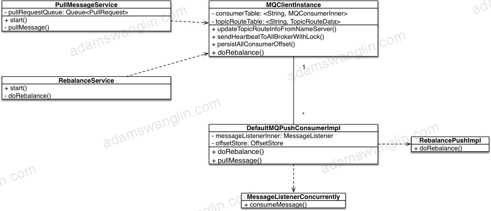
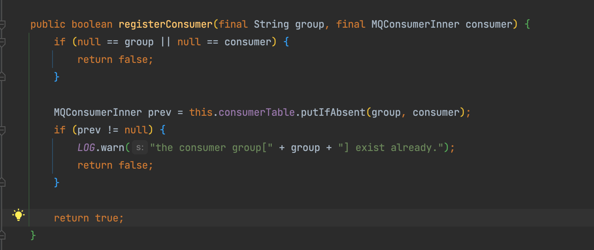
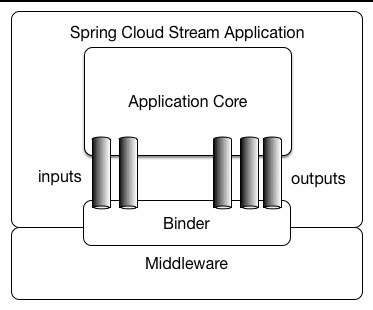
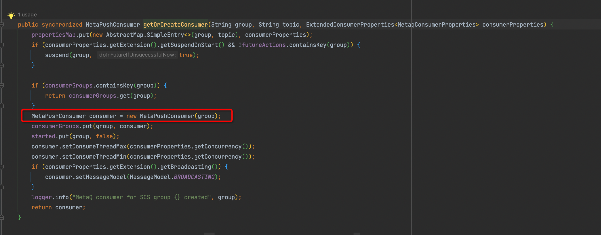
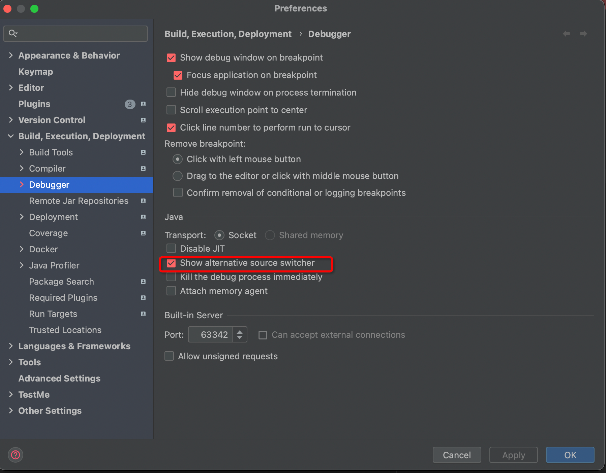
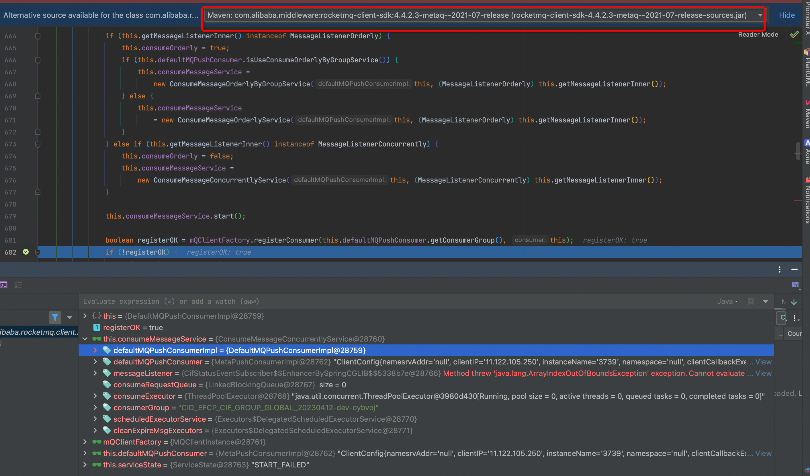

# ✅RocketMQ消费堆积问题排查
<!--page header-->

<a name="bH4t7"></a>
## 问题现象
负责的业务中有一个应用因为特殊原因，需要修改消息配置（将Spring Cloud Stream 改为 RocketMQ native），修改前和修改后的配置项如下：
```properties
spring.cloud.stream.bindings.consumerA.group=CID_CONSUMER_A
spring.cloud.stream.bindings.consumerA.contentType=text/plain
spring.cloud.stream.bindings.consumerA.destination=CONSUMER_A_TOPIC
spring.cloud.stream.rocketmq.bindings.consumerA.consumer.tags=CONSUMER_A_TOPIC_TAG

spring.cloud.stream.bindings.consumerB.group=CID_CONSUMER_A
spring.cloud.stream.bindings.consumerB.contentType=text/plain
spring.cloud.stream.bindings.consumerB.destination=CONSUMER_B_TOPIC
spring.cloud.stream.rocketmq.bindings.consumerB.consumer.tags=CONSUMER_B_TOPIC_TAG

spring.cloud.stream.bindings.consumerC.group=CID_CONSUMER_A
spring.cloud.stream.bindings.consumerC.contentType=text/plain
spring.cloud.stream.bindings.consumerC.destination=CONSUMER_C_TOPIC
spring.cloud.stream.rocketmq.bindings.consumerC.consumer.tags=CONSUMER_C_TOPIC_TAG
```
```properties
spring.rocketmq.consumers[0].consumer-group=CID_CONSUMER_A
spring.rocketmq.consumers[0].topic=CONSUMER_A_TOPIC
spring.rocketmq.consumers[0].sub-expression=CONSUMER_A_TOPIC_TAG
spring.rocketmq.consumers[0].message-listener-ref=consumerAListener

spring.cloud.stream.bindings.consumerB.group=CID_CONSUMER_A
spring.cloud.stream.bindings.consumerB.contentType=text/plain
spring.cloud.stream.bindings.consumerB.destination=CONSUMER_B_TOPIC
spring.cloud.stream.rocketmq.bindings.consumerB.consumer.tags=CONSUMER_B_TOPIC_TAG

spring.cloud.stream.bindings.consumerC.group=CID_CONSUMER_A
spring.cloud.stream.bindings.consumerC.contentType=text/plain
spring.cloud.stream.bindings.consumerC.destination=CONSUMER_C_TOPIC
spring.cloud.stream.rocketmq.bindings.consumerC.consumer.tags=CONSUMER_C_TOPIC_TAG
```
但是当机器发布一半后开始灰度观察的时候，出现了消息堆积问题：

<a name="tAhbc"></a>
## 问题原因
<a name="hiUTa"></a>
### 消息订阅关系不一致
经过历史经验和踩坑，感觉有可能是订阅组机器订阅关系不一致导致的消息堆积问题（因为订阅组的机器有的订阅关系是A，有的是B，MQ不能确定是否要消费，就能只能先堆积到broker中），查看MQ控制台后发现，确实是消息订阅关系不一致，导致消息堆积

已经发布的那台订阅如下：

未发布的订阅关系如下（明显多于已经发布的机器的订阅关系）

<a name="xJaTE"></a>
### Spring Cloud Stream 和 RocketMQ Native
所以就引申出了一个问题，为什么将Spring Cloud Stream修改为原生的MetaQ之后，同一个ConsumerId对应的订阅关系就会改变呢？
更简单来说，就是为什么当RocketMQ和Spring Cloud Stream 使用相同的ConsumerId之后，RocketMQ的订阅关系会把Spring Cloud Stream的订阅关系给冲掉呢？
> 注意，一个consumerId是可以订阅多个topic的

这个时候就只能翻Spring Cloud Stream 和 RocketMQ 的启动源码来解答疑惑。
<a name="Y0tAR"></a>
#### RocketMQ
RocketMQ client的类图如下：


- MQConsumerInner：记录当前consumerGroup和服务端的交互方式，以及topic和tag的映射关系。默认的实现是DefaultMQPushConsumerImpl，和consumerGroup的对应关系是1 : 1
- MQClientInstance：统一管理网络链接等可以复用的对象，通过Map维护了ConsumerGroupId和MQConsumerInner的映射关系。简单来说，就是一个ConsumerGroup，只能对应一个MQConsumerInner，如下代码所示：


<a name="Cl9OB"></a>
#### Spring Cloud Stream

Spring Cloud Stream是连接Spring和中间件的一个胶水层，在Spring Cloud Stream启动的时候，也会注册一个ConsumerGourp，如下代码所示：

<a name="xUlBK"></a>
### 问题根因
分析到这里，原因就已经很明显了。Spring Cloud Stream会在启动的时候自己new一个MetaPushConsumer（事实上就是一个新的MQConsumerInner），所以对于一个ConsumerGroup来说，就存在了两个MQConsumerInner，这显然是不符合RocketMQ要求的1:1的映射关系的，所以RocketMQ默认会用新的映射代替老的映射关系。显然，Spring Cloud Stream的被RocketMQ原生的给替代掉了。
这也就是为什么已经发布的机器中，对于ConsumerA来说，只剩下RocketMQ原生的那组订阅关系了
<a name="siVLs"></a>
## 解决思路
修改consumerId
```properties
spring.rocketmq.consumers[0].consumer-group=CID_CONSUMER_A
spring.rocketmq.consumers[0].topic=CONSUMER_A_TOPIC
spring.rocketmq.consumers[0].sub-expression=CONSUMER_A_TOPIC_TAG
spring.rocketmq.consumers[0].message-listener-ref=consumerAListener

spring.cloud.stream.bindings.consumerB.group=CID_CONSUMER_B
spring.cloud.stream.bindings.consumerB.contentType=text/plain
spring.cloud.stream.bindings.consumerB.destination=CONSUMER_B_TOPIC
spring.cloud.stream.rocketmq.bindings.consumerB.consumer.tags=CONSUMER_B_TOPIC_TAG

spring.cloud.stream.bindings.consumerC.group=CID_CONSUMER_B
spring.cloud.stream.bindings.consumerC.contentType=text/plain
spring.cloud.stream.bindings.consumerC.destination=CONSUMER_C_TOPIC
spring.cloud.stream.rocketmq.bindings.consumerC.consumer.tags=CONSUMER_C_TOPIC_TAG
```
<a name="c9ziy"></a>
## 思考和总结

1. 问题原因并不复杂，但是很多人可能分析到第一层（订阅关系不一致导致消费堆积）就不会再往下分析了，但是我们还需要有更深入的探索精神的
2. 生产环境中尽量不要搞两套配置项，会额外增加理解成本。。。。
<a name="TjCJ3"></a>
## 小技巧
<a name="xeWag"></a>
### 中间件代码如何确定版本
arthas中的sc 命令 

<a name="cL6Ot"></a>
### Idea如何debug具体版本的中间件





<!--page footer-->
- 原文: <https://www.yuque.com/hollis666/axzrte/za04hyyegpeg4h2i>