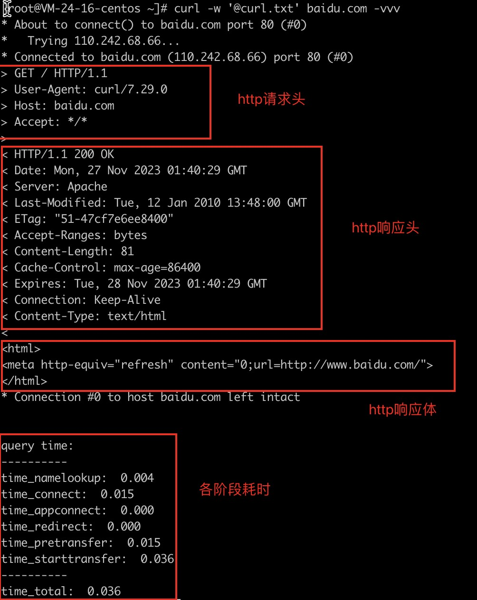
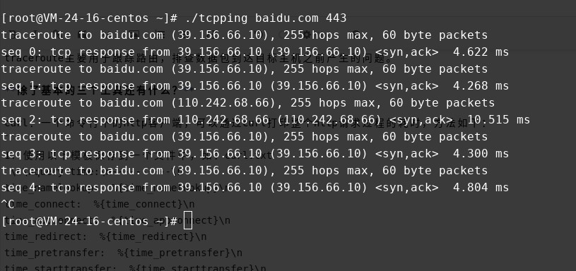

# ✅如何排查网络问题？
<!--page header-->

<a name="3c4e0a25"></a>
## 典型回答

**网络问题是指在典型的C/S或B/S通信中，客户端或浏览器向服务端发送数或接受数据的时候，因为网络不稳定或接收方异常导致的数据包丢失、无法连接等问题**。通常情况下TCP会通过重试的机制确保数据包在一段时间后到达接收方。如果是UDP需要应用自身实现重传机制确保在出现丢包后可重新发送。

> 注意本文讨论的内容基于Linux操作系统


我们可以使用一些基本的命令检测是否出现丢包、目标端口异常：

- `ping` 检测本机到目标主机是否通畅
- `telnet` 检测本机到目标主机端口是否通畅
- `traceroute` 检测本机到目标主机经过的路由是否通畅
<a name="RlKco"></a>
### ping

`ping`命令会发出`ICMP`类型的数据包，使用方法：

```
ping 目标ip/域名 # 如果不使用-c参数会一直ping，按ctrl+c停止
```


注意：ping的时候是不需要加"http"或者"https"的，直接ping域名。

ping存在的问题：

1. 由于ping使用ICMP协议，一些主机防火墙会丢弃ICMP报文，所以会导致ping不同
2. ping只是探测本机到目标主机的通路，并不探测目标端口是否有效

[✅ping的原理是什么？](https://www.yuque.com/hollis666/axzrte/ivry7a?view=doc_embed)

<a name="Mtuxx"></a>
### telnet

telnet 是一个网络协议，同时也是一个使用该协议的命令行工具。它最初被设计用于远程登录到服务器，但由于其安全性问题（主要是信息传输不加密），在现代网络环境中已经较少用于远程登录。然而，telnet 命令仍被广泛用作一种简单的工具来测试网络连接，特别是用于检查指定的IP地址和端口是否可达。

```
telnet 目标ip/域名 端口 
```


telnet存在的问题：

1. 无法感知到达目标主机的响应耗时
2. 交互式的体验，不太适合写在shell脚本中
3. telnet 不支持加密，发送的数据（包括登录凭据）都是明文。因此，它不适合用于任何涉及敏感信息的场景。

<a name="xXi6t"></a>
### traceroute

traceroute 是一个网络诊断工具，用于显示数据包从源主机到目标主机之间经过的路由（路径）。它可以帮助诊断数据包传输中的问题，例如确定网络延迟的位置或查看数据包的路径。

```
traceroute 目标ip/域名 

#traceroute常用参数：
1. -w 秒数 等待远端主机响应的时间，高于这个时间算为超时
2. -i 网卡 使用指定网卡发出数据包
3. -g 网关ip 设置经过哪个网关发出数据包
4. -m 跳数 设置经过路由的最大跳数
```

traceroute主要用于跟踪路由，排查数据包到达目标主机之前产生的问题。



<a name="GSpA1"></a>
# 扩展知识

<a name="C9toZ"></a>
## 其它工具

curl：一个命令行下的http客户端，可以通过curl打印整个http请求过程的耗时，方法如下：

```
1. 以下模板保存到一个文件中，如：curl.txt
 \n\nquery time:\n----------\n
time_namelookup:  %{time_namelookup}\n
time_connect:  %{time_connect}\n
time_appconnect:  %{time_appconnect}\n
time_redirect:  %{time_redirect}\n
time_pretransfer:  %{time_pretransfer}\n
time_starttransfer:  %{time_starttransfer}\n
----------\n
time_total:  %{time_total}\n

2. 使用curl 命令发起请求
curl -w '@curl.txt' baidu.com -vvv
```



各阶段响应耗时解释：

- time_namelookup: 域名解析所需的时间。
- time_connect: TCP 连接建立所需的时间。
- time_appconnect: TLS/SSL  握手完成所需的时间。
- time_pretransfer: 从请求开始到响应开始传输的时间。
- time_redirect: 重定向所需的时间。
- time_starttransfer: 从请求开始到第一个字节将要传输的时间，包括预传输时间和服务器处理结果所需的时间。
- time_total: 整个请求过程所需的总时间。

tcpping：tcpping是一个第三方的ping工具，可以用来ping某个端口。ping使用IMCP协议，而tcpping是通过TCP协议向给定的端口建立连接。_注意该工具需要单独安装。_


```
yum install tcptraceroute -y #安装依赖
wget http://www.vdberg.org/~richard/tcpping #下载tcpping
chmod 755 tcpping #设置可执行权限
./tcpping www.baidu.com 443
```

当然如果你不想这么复杂也可以使用`nc`命令，通常的Linux发行版都会自带这个命令

```
nc -zv www.baidu.com 443
```


tcpdump：tcpdump是很强大的命令行抓包工具，可以抓各种协议的数据包，同时配合wireshark图形化工具来分析网络通信。


tcpdump在一些Linux发行版中可能未安装，需要手动安装。wireshark可以在 [wireshark官网](https://www.wireshark.org/) 进行下载

```
tcpmdump -i eth0 dst port 443 -w 1.cap #抓取网卡eth0 目标端口为443的数据包保存到1.cap文件中
```

通过wireshark打开1.cap进行分析。


<!--page footer-->
- 原文: <https://www.yuque.com/hollis666/axzrte/us7bsygf7z1ocgd5>