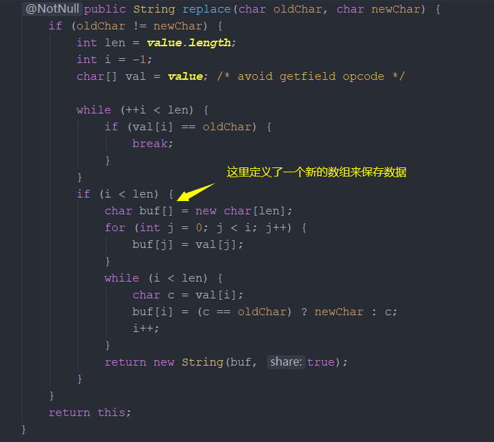
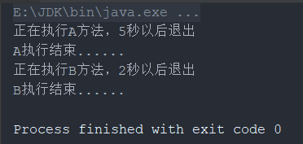

# ✅什么是不可变模式，有哪些应用？
<!--page header-->

在并发编程的世界里，共享变量的线程安全问题永远是一个无法避免且不得不面对的问题，如果只有读的情况，那么永远也不会出现线程安全的问题，因为多线程读永远是线程安全的，但是多线程读写一定会存在线程安全的问题。

那既然这么说是不是通过只读就能解决并发问题呢？其实最简单的办法就是让共享变量只有读操作，而没有写操作。这个办法如此重要，以至于被上升到了一种解决并发问题的设计模式：**不变性（Immutability）模式**。

所谓不变性，简单来讲，就是对象一旦被创建之后，状态就不再发生变化。换句话说，就是变量一旦被赋值，就不允许修改了（没有写操作）；没有修改操作，也就是保持了不变性。

<a name="e7584114"></a>
## 不可变性的类

在 java 中，如果要实现一个不可变的对象是很简单的，将其定义为 final 即可，同样类也是如此，只需要通过 final 来修饰某个类即可。同时将一个类所有的属性都设置成 final 的，并且只允许存在只读方法，那么这个类基本上就具备不可变性了。

更严格的做法是这个类本身也是 final 的，也就是不允许继承。因为子类可以覆盖父类的方法，有可能改变不可变性，所以推荐你在实际工作中，使用这种更严格的做法。

我们再日常开发中，已经在不知不觉中享受不可变模式带来的好处，例如经常用到的 `String、Long、Integer、Double` 等基础类型的包装类都具备不可变性，这些对象的线程安全性都是靠不可变性来保证的。


仔细翻看这些类的声明、属性和方法，你会发现它们都严格遵守不可变类的三点要求：类是 final 的，属性也是 final 的。同样的一旦某个类被 final 修饰，其本身就不能被继承了，也就无法重写其方法，即方法是只读的。


既然说方法是只读的，但是 Java 的 String 方法也有类似字符替换操作，这个不就已经改变了value[] 变量了吗？因为 value[] 是这么定义的。


我们结合 String 的源代码(jdk8)来看一下 jdk 是如何处理这个问题的，下面是源码的截图



它实际上是重新定义了一个新的 buf[] 来保存数据，这样在最后返回数据的时候确实确没有修改 原始的value[]，而是将替换后的字符串作为返回值返回了。

通过分析 String 的实现，你可能已经发现了，如果具备不可变性的类，需要提供类似修改的功能，具体该怎么操作呢？做法很简单，那就是创建一个新的不可变对象，这是与可变对象的一个重要区别，可变对象往往是修改自己的属性。

所有的修改操作都创建一个新的不可变对象。但是一个问题的解决必然会带来的新的问题，那就是这样势必在每次使用的时候都会创建新的对象，那岂不是无端的降低了系统的性能了浪费了系统的资源？这个时候享元模式就可以大显神通了。

<a name="e62a467c"></a>
## 享元模式避免创建重复对象

享元模式你可能实际开发中使用的很少，它是这么定义的：

享元模式（Flyweight Pattern）：是一种软件设计模式。它使用共享物件，用来尽可能减少内存使用量以及分享资讯给尽可能多的相似物件；它适合用于只是因重复而导致使用无法令人接受的大量内存的大量物件。

通常物件中的部分状态是可以分享。常见做法是把它们放在外部数据结构，当需要使用时再将它们传递给享元

看不懂没关系，用一句直白话来概括就是：通过对象池的技术来避免重复的创建对象。这就好比是 Spring 中的容器（单例模式下），我们的对象都交给 Spring 容器来管理，这样我们再使用的时候只需要到容器中去拿即可，而不是每次都去创建新的对象。

利用享元模式可以减少创建对象的数量，从而减少内存占用。Java 语言里面 `Long、Integer、Short、Byte` 等这些基本数据类型的包装类都用到了享元模式。

**享元模式本质上其实就是一个对象池**，利用享元模式创建对象的逻辑也很简单：**创建之前，首先去对象池里看看是不是存在；如果已经存在，就利用对象池里的对象；如果不存在，就会新创建一个对象，并且把这个新创建出来的对象放进对象池里**。

jdk 源码中是如何使用享元模式的呢？我们以 Long 这个类为例来解释说明下。

Long 这个类并没有照搬享元模式，Long 内部维护了一个静态的对象池，仅缓存了[-128,127]之间的数字，这个对象池在 JVM 启动的时候就创建好了，而且这个对象池一直都不会变化，也就是说它是静态的。之所以采用这样的设计，是因为 Long 这个对象的状态共有 2^64 种，实在太多，不宜全部缓存，而[-128,127]之间的数字利用率最高。

下面的示例代码出自 Java 1.8，valueOf() 方法就用到了 LongCache 这个缓存，你可以结合着来加深理解。


在看下 LongCache 中的 cache 方法（关键地方都在图片的注释中了）


<a name="73b7662d"></a>
## 基本类型包装类作为锁对象

正是由于这些包装类内部用了享元模式，所以基本上所有的基础类型的包装类都不适合做锁，因为它们内部用到了享元模式，这会导致看上去私有的锁，其实是共有的。看下下面的代码，我们假设以 Long 对象作为锁，

```
class A {
    //定义一个 A 对象名字叫 aObj ,值为 1
    private Long aObj = Long.valueOf(1);
    //定义一个 B 对象名字叫 bObj，值为 1
    private Long bObj = Long.valueOf(1);

    private void a() {
        //锁对象是 aObj
        synchronized (aObj) {
            System.out.println("正在执行A方法，5秒以后退出");
            try {
                TimeUnit.SECONDS.sleep(5);
                System.out.println("A执行结束......");
            } catch (InterruptedException e) {
                e.printStackTrace();
            }
        }
    }

    private void b() {
        //锁对象是 bObj
        synchronized (bObj) {
            System.out.println("正在执行B方法，2秒以后退出");
            try {
                TimeUnit.SECONDS.sleep(2);
                System.out.println("B执行结束......");
            } catch (InterruptedException e) {
                e.printStackTrace();
            }
        }
    }

    public static void main(String[] args) throws InterruptedException {
        A a = new A();
        //开通两个线程来执行，因为aObj 和 bObj 是不同的对象，所以理论上应该是互不干扰的
        new Thread(a::a).start();
        TimeUnit.SECONDS.sleep(1);
        new Thread(a::b).start();
    }
}
```



但是却出现了上面这样的结果？为什么会是同步的执行呢？就是因为享元模式导致的，因为 1 是在 [-128~127] 的，所以定义再多的对象都是直接从缓存池中拿的，并不会创建新的对象，**即锁的是同一个对象**。现在改成一个不在 [-128~127] 范围之内的，假设是128


结果为：


这个时候发现两个是互不干扰的，也就是**两个锁并不是同一个对象**。

<a name="3fdade20"></a>
## 使用 Immutability 模式的注意事项

在使用 Immutability 模式的时候，需要注意以下两点：

1. 对象的所有属性都是 final 的，并不能保证不可变性；
2. 不可变对象也需要正确发布。

在 Java 语言中，final 修饰的属性一旦被赋值，就不可以再修改，但是如果属性的类型是普通对象，那么这个普通对象的属性是可以被修改的。什么鬼？乱七八糟的。别急，我们来看个例子（毕竟光说含义就是等于在耍流氓）。

```
class D {
    final C c;

    public D(C c) {
        this.c = c;
    }

    private void changeValue(int salary) {
        c.setSalary(salary);
    }

    public static void main(String[] args) {
        C c = new C();
        c.setSalary(1);
        System.out.println("c.getSalary() = " + c.getSalary());
        D d = new D(c);
        d.changeValue(3);
        System.out.println("c.getSalary() = " + c.getSalary());
    }
}
```


**在使用 Immutability 模式的时候一定要确认保持不变性的边界在哪里，是否要求属性对象也具备不可变性**。这里的C对象是不可变的，但是里面的属性却是可以修改的。如果想要属性也不可以被修改，那么属性也必须要定义为 final 的。像这样的临界问题在处理的时候一定要加倍小心。

<a name="9019b3d7"></a>
## 本文小结

利用 Immutability 模式解决并发问题，也许你觉得有点陌生，其实你天天都在享受它的战果。Java 语言里面的 String 和 Long、Integer、Double 等基础类型的包装类都具备不可变性，这些对象的线程安全性都是靠不可变性来保证的。Immutability 模式是最简单的解决并发问题的方法，建议当你试图解决一个并发问题时，可以首先尝试一下 Immutability 模式，看是否能够快速解决。

具备不变性的对象，只有一种状态，这个状态由对象内部所有的不变属性共同决定。其实还有一种更简单的不变性对象，那就是无状态。无状态对象内部没有属性，只有方法。除了无状态的对象，你可能还听说过无状态的服务、无状态的协议等等。无状态有很多好处，最核心的一点就是性能。在多线程领域，无状态对象没有线程安全问题，无需同步处理，自然性能很好；在分布式领域，无状态意味着可以无限地水平扩展，所以分布式领域里面性能的瓶颈一定不是出在无状态的服务节点上。


<!--page footer-->
- 原文: <https://www.yuque.com/hollis666/axzrte/qlohhe>