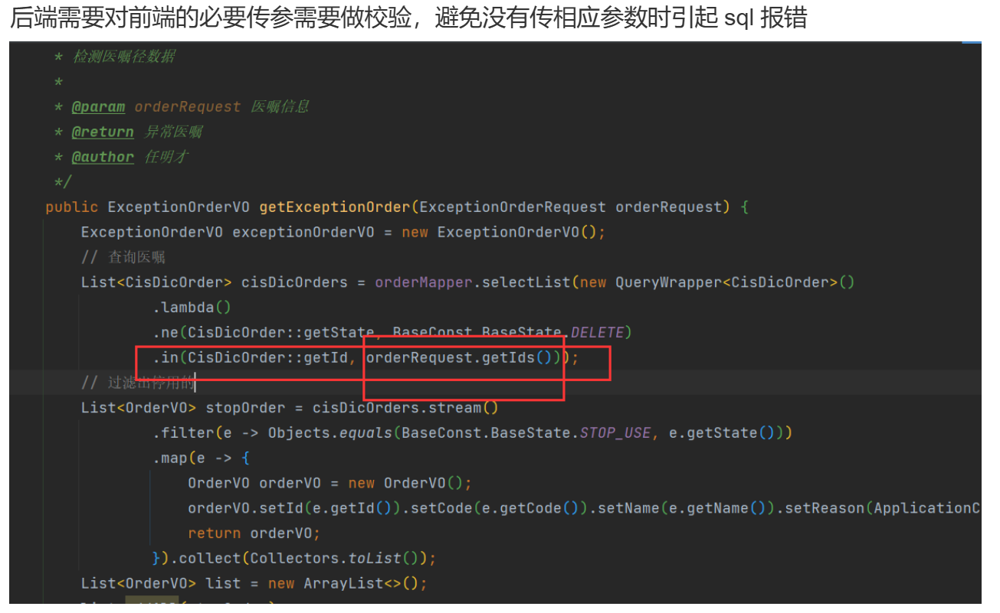
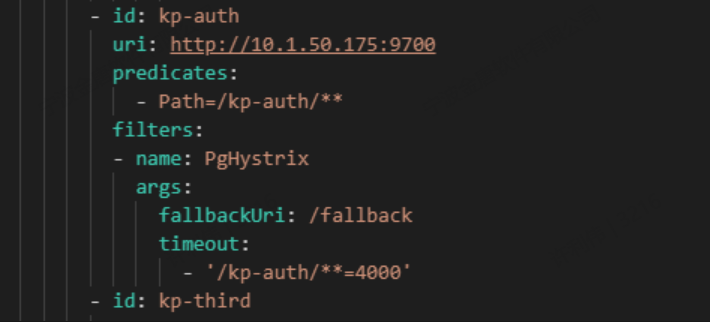
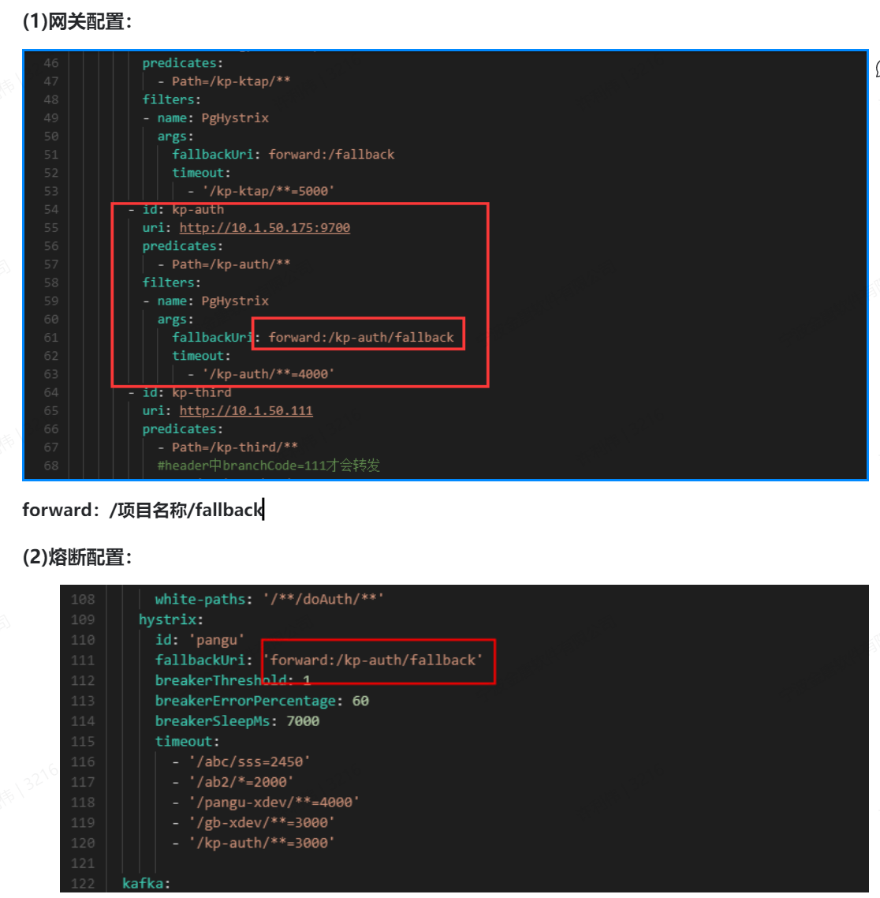
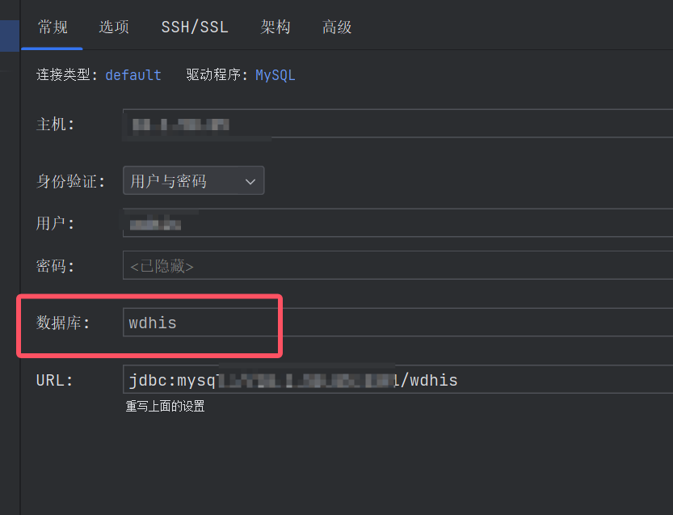
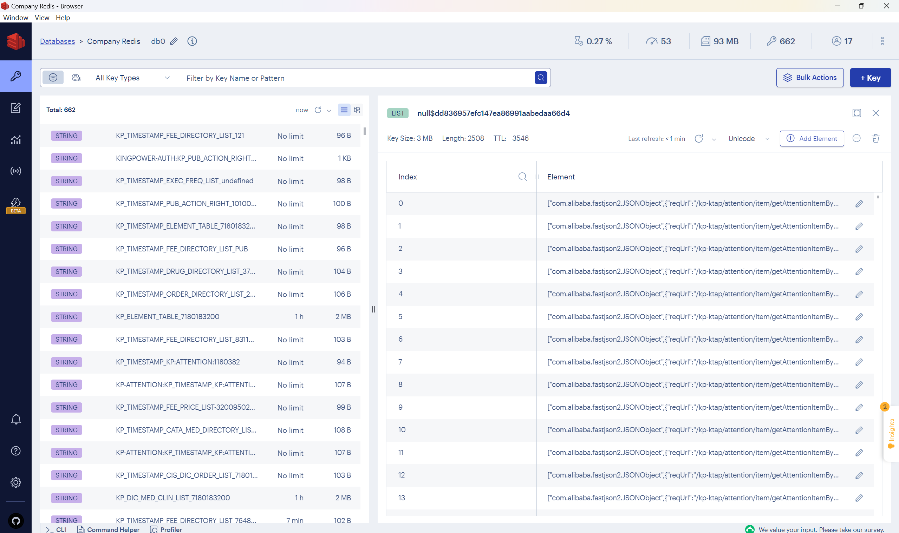
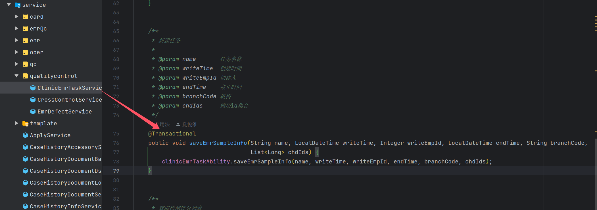
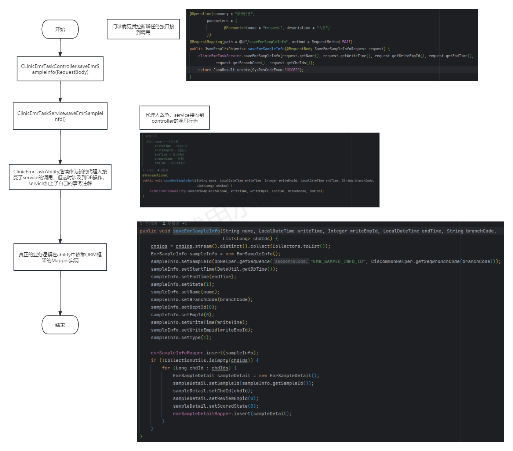

# 开发规范

## 命名规范

严格按照小驼峰命名，转换过程中发现之前命名不规范的直接进行调整处理。

命名方式：

小驼峰命名规范：

```sql
首字母小写：命名的第一个单词的首字母小写。
后续单词首字母大写：从第二个单词开始，每个单词的首字母大写。
单词之间无分隔符：单词之间没有空格或其他分隔符。
以下是一些符合小驼峰命名规范的示例：
变量命名：firstName、lastName、age、isStudent。
函数命名：calculateSum、printMessage、getData。
方法命名：setName、getName、updateAge。

```

区别于小驼峰命名规范，下面是大驼峰命名规范：

```java
大驼峰命名规范（Upper Camel Case），也被称为帕斯卡命名法（Pascal Case），也是一种常见的编程命名规范，具体规则如下：
每个单词的首字母大写：组成名称的每个单词的首字母都大写，而不仅仅是第一个单词的首字母。
单词之间无分隔符：与小驼峰命名法类似，单词之间没有空格或其他分隔符。
```

## 设置git提交时的用户名：

```
git config --global user.name "提交预期登记的用户名称。" 
```

## 未完成事项：

有问题或者未填写内容，统一添加 //TODO 进行标记，后面统一处理

## MYSQL特殊语法：

```SQL
INSERT INTO table_name (column1, column2, column3,...)
VALUES (value1, value2, value3,...)
ON DUPLICATE KEY UPDATE
    column1 = value1,
    column2 = value2,
    column3 = value3,
   ...;
```

解释：

* `ON DUPLICATE KEY UPDATE`：这是该语法的关键部分，用于在插入数据时，如果遇到唯一键冲突（即插入的数据与表中已有的数据在唯一键上的值相同），则执行更新操作。

不允许特殊化语法，SQL要考虑兼容多种类型数据库，不要出现特殊化语法。

## 敏感信息加密处理：

禁止将密码返回给前端，如果需要修改密码判断，应该通过走后端接口校验



## List获取元素

使用List集合接口的时候，不建议使用get操作，因为不确定集合是否含有元素，可能会发生NPE异常。

> list如果要按下标方式获取数据的，在不能确保数据一定可以获取得到的情况下，一定要进行前置判断，建议非必要尽量不要使用get(i)这种方式

## 不能使用SELECT *操作！

> 数据库查询不要使用*，使用select * 取出全部列，会让优化器无法完成索引覆盖扫描这类优化，会影响优化器对执行计划的选择，也会增加网络带宽消耗，更会带来额外的I/O,内存和CPU消耗，建议提出业务实际需要的列数，将指定列名取代select *。

## 函数

不要使用冷门函数，尽量使用通用函数

## 获取数据库时间

后端新增时间、修改时间 存储时调用该方法获取，禁止使用LocaldateTime.now()方式

使用示例：

```
DateUtil.getDbTime();
```

## 后端公共排序方法【id，ord类型】

后端有按ord拖拽排序的修改下，统一了前后端的入参方式，后端使用调用公共方法方式处理

前端传参[{id:1,ord:1},{id:2,ord:2}...]即可

2022-11-21优化：增加了空值判断检测

2022-11-17优化：支持前端ord为旧值情况下后端的重排序，也兼容之前旧的写法

## 树形转换【id，pid模式】

提供如下几种

使用示例：

```
CommonTreeUtil.listToTreeEx(MenuAuthVO.class, menuList,TreeParentMenuAuthVO.class, parentMenus,"id","parentId","children");
```

## excel导入导出

使用示例：

```java
导出
TestDTO bean1 =newTestDTO();
        bean1.setName("张三");
        bean1.setAge(22);
        bean1.setIsPass(1);
        bean1.setScore(BigDecimal.valueOf(66.30));
        bean1.setExamDate(LocalDate.now());

TestDTO bean2 =newTestDTO();
        bean2.setName("李四");
        bean2.setAge(28);
        bean2.setIsPass(0);
        bean2.setScore(BigDecimal.valueOf(38.50));
        bean2.setExamDate(LocalDate.now());

List<TestDTO> rows =CollUtil.newArrayList(bean1, bean2);

Map<String, String> headerAliasMap =newLinkedHashMap<>();
//自定义标题
        headerAliasMap.put("name","姓名");
        headerAliasMap.put("age","年龄");
        headerAliasMap.put("score","分数");
        headerAliasMap.put("isPass","是否通过");
        headerAliasMap.put("examDate","考试时间");

ExcelUtil.WriteExcel(URLEncoder.encode("这是导出的文件名"+".xlsx",StandardCharsets.UTF_8), rows, headerAliasMap,true, response);

导入
Map<String, String> headerAliasMap =newLinkedHashMap<>();
//自定义标题
        headerAliasMap.put("姓名","name");
        headerAliasMap.put("年龄","age");
        headerAliasMap.put("分数","score");
        headerAliasMap.put("是否通过","isPass");
        headerAliasMap.put("考试时间","examDate");
List<TestDTO> dataList =ExcelUtil.ReadExcel(file.getInputStream(),null, headerAliasMap,TestDTO.class);
```

服务部署的硬件条件：

```
数据库：
TiDB（6.0版本）

需要部署服务：
云HIS所有MySQL服务器，包含：框架、接口、云经济、云药事、云全科。
KingPower服务（ktap、ktcis、ktemr）。
redis服务
nginx服务

服务器：
Linux服务器
内存：32G
处理器：8核
硬盘：300G
```

## MySQL和TIDB的兼容性问题

版本对应：TIDB6.0对应MySQL8.0

语法上基本完全相同

配置文件数据库连接：

可参考（type=tidb是进行的一个标识，我们主要是sql跟踪的时候会有用到

```yml
 datasource:
    dynamic:
      primary: wdhis #设置默认的数据源或者数据源组,默认值即为master
      strict: false #严格匹配数据源,默认false. true未匹配到指定数据源时抛异常,false使用默认数据源
      seata: false #seata1.0之后支持自动代理 这里直接配置true
      seata-mode: at #seata模式使用的at
      datasource:
        wdhis:
          type: com.zaxxer.hikari.HikariDataSource
          url: jdbc:mysql://10.1.50.193:3390/wdhis?characterEncoding=utf8&serverTimezone=Asia/Shanghai&allowMultiQueries=true&tinyInt1isBit=false&type=tidb
          username: wdhis
          password: wdhis
          driver-class-name: com.mysql.cj.jdbc.Driver
```

执行计划查询：

```sql
EXPLAIN 语句只返回查询的执行计划，并不执行该查询。若要获取实际的执行时间，可执行该查询，或使用 EXPLAIN ANALYZE 语句
```

**子查询内存上限：**

大sql执行可能存在内存溢出情况，目前我们的tidb默认单条sql运行内存为2G，一般内存溢出是子查询引起，需要对子查询进行优化或者拆分出来单独处理

tidb聚合函数较弱，通常要配合group by 来减少结果集或以此来命中索引

## 服务熔断

#### 1. 单接口的熔断

单接口的熔断，在原来接口上增加/fallback路径，需要和研发确认该接口存在，相当于个性配置

配置单个接口熔断的时候是这样子的：



当超时超过参数timeout: 访问路径带有 /kp-auth 下的所有路径 超过4秒 跳转到所访问的路径下加上 /fallback

例如： /ktap/a/b      -->     /ktap/a/b/fallback    发生转移

配置信息：

```yml
hystrix:
id: 'pangu'
fallbackUri: 'forward:/fallback'   #触发后转发到的接口路径
breakerThreshold: 1     #断路器的阈值数
breakerErrorPercentage: 60     #百分比阈值数
breakerSleepMs: 7000     #断路器触发后的休眠时间  
timeout:
  - '/abc/sss=2450'
  - '/ab2/*=2000' 
  - '/pangu-xdev/**=4000'
  - '/gb-xdev/**=3000'
  - '/kp-auth/**=3000'    #超时时间，对应的是上面转发的接口超时时间
```

#### 配置整个项目的熔断



> 生效问题：网关配置 nacos发布后 即时生效！！

## SQL瘫痪真实案例分析

事故情况：**TiDB**服务器** **CPU100%** **，导致整个系统处于瘫痪状态！！！**

**主要原因：**

 **1** **）数据库****SQL****隐式转换，会自动转换成关联子查询；**

 **2**  **）** **OIS_ORDER_DETAIL****是个大表，查询数据量大，内存消耗大；**

 **3** **）全主业务在用，高峰期使用频率**

## 标量子查询 ：

标量子查询是一种特殊类型的子查询，它返回的结果是一个单一的值（即一个标量），而不是一个数据集。它通常用于在主查询中作为一个条件或者表达式的一部分，为查询提供动态的、基于数据的条件或值。

#### 语法结构

标量子查询的语法结构类似于普通的子查询，只是它的结果必须是一个单一的值。例如：

```sql
SELECT column_name
FROM table_name
WHERE condition = (SELECT scalar_value FROM another_table WHERE another_condition);
```

在这个例子中，括号内的子查询 `(SELECT scalar_value FROM another_table WHERE another_condition)` 就是一个标量子查询，它返回的单一值将与主查询中的 `condition` 进行比较。

#### 特点

* **返回单一值** ：这是标量子查询的核心特点，它与其他类型的子查询（如返回多行多列的子查询）区别开来。
* **可以嵌套使用** ：标量子查询可以嵌套在其他查询或表达式中，以构建更复杂的查询逻辑。
* **与外部查询相关联** ：标量子查询通常依赖于外部查询中的值，通过引用外部查询的列或表达式来生成动态的条件或值。

#### 应用场景

* **作为查询条件** ：用于在 `WHERE` 子句中提供动态的筛选条件。例如，根据另一个表中的某个值来筛选当前表中的数据。
* **用于计算列值** ：在 `SELECT` 语句中，作为一个表达式来计算新的列值。例如，根据其他列的值进行一些数学运算或逻辑判断，生成一个新的列。
* **数据验证和关联** ：在数据插入或更新操作中，用于验证数据的合法性或关联其他表中的数据。

#### 示例

假设有两个表：`orders` 表包含订单信息，`customers` 表包含客户信息。要查询所有订单金额大于某个特定客户平均订单金额的订单，可以使用标量子查询来实现：

```sql
SELECT order_id, order_amount
FROM orders
WHERE order_amount > (SELECT AVG(order_amount) FROM orders WHERE customer_id = 123);
```

在这个例子中，子查询 `(SELECT AVG(order_amount) FROM orders WHERE customer_id = 123)` 返回了客户 `123` 的平均订单金额，然后主查询筛选出订单金额大于该平均金额的订单。

#### 注意事项

* **性能问题** ：如果标量子查询的执行效率低下，可能会影响整个查询的性能。因此，在使用标量子查询时，需要注意优化子查询的执行计划。
* **结果的确定性** ：标量子查询必须返回一个确定的单一值，如果子查询返回多个值或者没有值，将会导致错误。
* **与外部查询的关联性** ：标量子查询依赖于外部查询的环境，如果外部查询的条件发生变化，可能会影响子查询的结果。因此，在使用标量子查询时，需要确保子查询与外部查询的关联性是正确的。c创

## 创建不可修改的Map

```java
 public static final Map<String, String> BASE_HEADERS;
        static {
            Map<String, String> baseHeaders = new LinkedHashMap<>();
            baseHeaders.put("statusName", "审核状态");
            baseHeaders.put("applyNo", "申请序号");
            baseHeaders.put("requestName", "申请人员");
            baseHeaders.put("requestReason", "申请理由");
            baseHeaders.put("mrNo", "病案号");
            baseHeaders.put("visitNo", "就诊号");
            baseHeaders.put("patName", "姓名");
            baseHeaders.put("idCard", "身份证号");
            baseHeaders.put("dept", "科室");
            baseHeaders.put("wardName", "病区");
            baseHeaders.put("cisDiagNamePri", "临床主诊断");
            baseHeaders.put("inDiagName", "首页主诊断");
            baseHeaders.put("verifyEmpName", "审核人员");
            baseHeaders.put("failureReason", "拒绝理由");
            BASE_HEADERS = Collections.unmodifiableMap(baseHeaders);
        }
```

## 根据有限元素创建列表

使用有限元素构建方法：

```java
 public static final List<String> MED_HEADERS = List.of(
            "病案号", "就诊号", "电子状态", "姓名", "身份证号", "病区",
            "科室", "主管医生", "入院日期", "出院日期", "住院天数",
            "临床主诊断", "首页主诊断", "费别", "送交人员", "签收人员",
            "编码人员", "质控人员", "归档人员"
    );
```

### 换行符

字符串末尾的 `\r\n`是回车符（Carriage Return）和换行符（Line Feed）的组合，通常用于表示文本的换行。

#### 校招生上手工作的基本流程：

从负责一个小的项目开始，搭建，设计，大致流程过完。负责一些模块和工作内容，工作主要还是对业务

## 数据库版本


## 选择数据库架构，让Mapper.xml少一点爆红



涉及到精度数据的比较时：


公司Redis缓存规模：



## 一定要加@Autowired注解吗？？

> 在 Spring4.x 中增加了新的特性：如果类只提供了一个带参数的构造方法，则不需要对对其内部的属性写 @Autowired 注解，Spring 会自动为你注入属性。

spring在4.x版本后就推荐使用构造器的方式的来注入fileld

## 来分析一下什么时候会使用到事务的注解：



根据常识，涉及到增删改的操作基本上都有事务的存在，而且公司业务数据量基本上都和DB直接获取，来看看这个操作的全流程。



看来事务注解加再Service上，那能用细粒度声明式事务注解来细化吗？？？

事实上，控制层和服务service再这里都只是作为代理人进行了业务方法的调用而已，真正涉及业务操作的是ability。那为什么不加在Ability层面上呢？下位豆包同学的回答：

>
> 事务注解一般加在 Service 层而不是 Mapper 操作层面或 Ability 层面，主要有以下原因：
>
> * **Mapper 操作层面** ：
> * **职责单一性** ：Mapper 层（数据访问层）的主要职责是与数据库进行交互，执行具体的 SQL 操作，如增删改查等。它只关注数据的持久化和读取，不应该包含业务逻辑。如果在 Mapper 层方法上添加事务注解，会使 Mapper 层不仅要处理数据访问，还要负责事务管理，这违背了职责单一原则，导致代码的耦合度增加，不利于代码的维护和扩展。例如，当需要修改事务的传播行为或隔离级别时，需要在多个 Mapper 方法中进行修改，增加了出错的风险。
> * **细粒度控制困难** ：在实际应用中，一个业务操作可能涉及多个 Mapper 方法的调用。如果在每个 Mapper 方法上都添加事务注解，会导致事务的粒度过于细小，增加了事务管理的复杂性。例如，一个订单创建的业务操作可能需要调用插入订单主表、插入订单详情表、更新库存等多个 Mapper 方法。如果每个方法都有自己的事务，那么在出现异常时，很难准确地控制事务的回滚范围，可能会导致部分数据更新成功，部分数据更新失败，从而破坏数据的一致性。而在 Service 层方法上添加事务注解，可以将整个业务操作作为一个事务进行管理，方便对事务进行统一的控制和协调。
> * **性能问题** ：事务的开启和提交是有一定开销的，如果在 Mapper 层的每个方法上都添加事务注解，会导致事务的频繁开启和提交，增加了系统的性能开销。特别是在高并发的情况下，这种性能开销可能会对系统的性能产生较大的影响。而在 Service 层方法上添加事务注解，可以将多个相关的 Mapper 方法放在一个事务中执行，减少事务的开启和提交次数，提高系统的性能。
> * **Ability 层面** ：
> * **与业务逻辑的耦合度** ：虽然 Ability 真正使用 Mapper 来操作数据库，但 Ability 通常是对业务能力的抽象，它可能包含了多个业务操作的组合。如果在 Ability 层面上添加事务注解，会使 Ability 与具体的业务逻辑紧密耦合，不利于 Ability 的复用和扩展。例如，一个 Ability 可能提供了创建订单、查询订单、取消订单等多个业务操作，每个操作可能涉及不同的 Mapper 方法调用。如果在 Ability 层面上添加事务注解，那么当需要修改某个业务操作的事务行为时，可能会影响到其他业务操作，增加了代码的维护难度。
> * **事务传播的复杂性** ：事务传播是指在多个事务方法之间的调用关系中，如何管理事务的行为。在 Spring 框架中，事务传播有多种方式，如 REQUIRED、SUPPORTS、MANDATORY 等。如果在 Ability 层面上添加事务注解，需要考虑事务传播的问题，以确保事务的正确执行。例如，当一个 Ability 方法调用另一个 Ability 方法时，需要根据业务需求确定事务的传播行为，是在同一个事务中执行，还是开启新的事务。这增加了事务管理的复杂性，容易出现事务传播错误的情况。而在 Service 层方法上添加事务注解，可以根据业务方法的具体需求，灵活地配置事务传播行为，简化了事务管理的复杂性。
> * **可测试性** ：在进行单元测试时，通常需要对 Service 层的方法进行单独测试，以验证业务逻辑的正确性。如果在 Ability 层面上添加事务注解，那么在测试 Service 层方法时，可能会受到事务的影响，导致测试结果不准确。例如，当测试一个 Service 层方法时，可能会因为事务的提交或回滚，导致数据库中的数据发生变化，从而影响到后续的测试用例。而在 Service 层方法上添加事务注解，可以方便地在测试时控制事务的行为，例如通过配置事务的传播行为为 NEVER，来禁止事务的开启，从而提高测试的准确性和可重复性。

## 什么样的情况下才需要真正的细粒度事务？

> 在一个复杂的业务系统中，有一个主要的业务流程包含多个子操作，其中一些子操作需要独立的事务控制，以满足不同的业务需求和数据一致性要求

参考事务分析文章。
